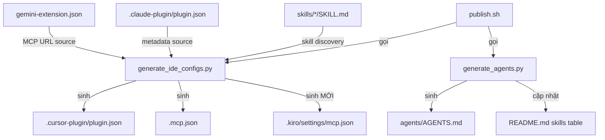

# Tài liệu Thiết kế — Tích hợp Kiro vào Hugging Face Skills

## Tổng quan

Tính năng này mở rộng repository `huggingface/skills` để hỗ trợ Kiro IDE/CLI, bổ sung vào danh sách agent tools đã được hỗ trợ (Claude Code, Codex, Gemini CLI, Cursor). Kiro tuân theo chuẩn mở Agent Skills (agentskills.io) — cùng định dạng `SKILL.md` với YAML frontmatter mà repo đang sử dụng — nên việc tích hợp chủ yếu tập trung vào:

1. Sinh file cấu hình MCP `.kiro/settings/mcp.json` trong publish pipeline
2. Cập nhật README với hướng dẫn cài đặt cho Kiro
3. Bổ sung hướng dẫn Kiro vào skill `hf-mcp`

Không cần thay đổi định dạng SKILL.md hay cấu trúc thư mục skills — chúng đã tương thích sẵn.

### Quyết định thiết kế chính

- **Tái sử dụng `generate_cursor_plugin.py`**: Thay vì tạo script mới, mở rộng script hiện có để sinh thêm `.kiro/settings/mcp.json`. Script này đã có logic trích xuất MCP URL từ `gemini-extension.json` — tái sử dụng đảm bảo tính nhất quán.
- **Đổi tên script**: Đổi `generate_cursor_plugin.py` thành `generate_ide_configs.py` vì giờ nó sinh config cho cả Cursor và Kiro.
- **Không cần chuyển đổi skills**: Kiro đọc `SKILL.md` với YAML frontmatter (name, description) — đúng định dạng repo đang dùng.

## Kiến trúc

### Luồng dữ liệu Publish Pipeline



### Cấu trúc file mới/thay đổi

```
skills/
├── .kiro/
│   └── settings/
│       └── mcp.json              # MỚI - Kiro MCP config (generated)
├── scripts/
│   ├── generate_ide_configs.py   # ĐỔI TÊN từ generate_cursor_plugin.py
│   └── publish.sh                # CẬP NHẬT - thêm .kiro/settings/mcp.json
├── README.md                     # CẬP NHẬT - thêm section Kiro
└── hf-mcp/skills/hf-mcp/
    └── SKILL.md                  # CẬP NHẬT - thêm hướng dẫn Kiro
```

## Thành phần và Giao diện

### 1. `generate_ide_configs.py` (đổi tên từ `generate_cursor_plugin.py`)

Mở rộng script hiện có với các thay đổi:

**Hằng số mới:**
```python
KIRO_MCP_CONFIG = ROOT / ".kiro" / "settings" / "mcp.json"
```

**Hàm mới:**
```python
def build_kiro_mcp_config() -> dict:
    """Sinh Kiro MCP config từ cùng nguồn gemini-extension.json."""
    server_name, url = extract_mcp_from_gemini()
    return {
        "mcpServers": {
            server_name: {
                "url": url
            }
        }
    }
```

**Cập nhật `main()`:**
- Sinh thêm `.kiro/settings/mcp.json` cùng lúc với `.cursor-plugin/plugin.json` và `.mcp.json`
- Chế độ `--check` kiểm tra cả file Kiro config

**Giao diện không đổi:**
- CLI interface giữ nguyên: `uv run scripts/generate_ide_configs.py [--check]`
- Hàm `extract_mcp_from_gemini()` được tái sử dụng, không thay đổi

### 2. `publish.sh`

**Thay đổi:**
- Cập nhật `GENERATED_FILES` array thêm `.kiro/settings/mcp.json`
- Cập nhật lệnh gọi script từ `generate_cursor_plugin.py` sang `generate_ide_configs.py`
- Cập nhật help text

### 3. `README.md`

**Thay đổi:**
- Thêm section "### Kiro" trong phần Installation, sau section Cursor
- Nội dung: hướng dẫn copy/symlink skills + cấu hình MCP

### 4. `hf-mcp/skills/hf-mcp/SKILL.md`

**Thay đổi:**
- Thêm hướng dẫn setup MCP cho Kiro sau phần setup link hiện có

## Mô hình Dữ liệu

### Kiro MCP Config (`.kiro/settings/mcp.json`)

```json
{
  "mcpServers": {
    "huggingface-skills": {
      "url": "https://huggingface.co/mcp?login"
    }
  }
}
```

Cấu trúc này tương đồng với `.mcp.json` (Cursor config) đã có trong repo. Cả hai đều được sinh từ cùng nguồn `gemini-extension.json`.

### So sánh định dạng MCP config giữa các agent tools

| Agent Tool | File | Định dạng |
|-----------|------|-----------|
| Cursor | `.mcp.json` | `{"mcpServers": {"name": {"url": "..."}}}` |
| Kiro | `.kiro/settings/mcp.json` | `{"mcpServers": {"name": {"url": "..."}}}` |
| Gemini | `gemini-extension.json` | `{"mcpServers": {"name": {"httpUrl": "..."}}}` |

Cursor và Kiro dùng key `url`, Gemini dùng `httpUrl`. Logic `extract_mcp_from_gemini()` đã xử lý sự khác biệt này.


## Correctness Properties

*Một property là một đặc tính hoặc hành vi phải đúng trong mọi lần thực thi hợp lệ của hệ thống — về bản chất là một phát biểu hình thức về những gì hệ thống phải làm. Properties đóng vai trò cầu nối giữa đặc tả dễ đọc cho con người và đảm bảo tính đúng đắn có thể kiểm chứng bằng máy.*

### Property 1: Kiro MCP config có cấu trúc JSON hợp lệ

*For any* valid `gemini-extension.json` input (có hoặc không có `mcpServers`, có `url` hoặc `httpUrl`), hàm `build_kiro_mcp_config()` phải trả về một dict có key `mcpServers` chứa ít nhất một entry với key `url` là string không rỗng.

**Validates: Requirements 2.2, 2.4**

### Property 2: URL nhất quán giữa Kiro và Cursor configs

*For any* valid `gemini-extension.json` input, URL trong output của `build_kiro_mcp_config()` phải bằng URL trong output của `build_mcp_config()` (Cursor config). Cả hai đều phải trích xuất từ cùng nguồn dữ liệu.

**Validates: Requirements 2.3, 3.4**

### Property 3: Mọi skill đều có SKILL.md hợp lệ với frontmatter

*For any* skill directory trong `skills/*/`, directory đó phải chứa file `SKILL.md` với YAML frontmatter hợp lệ bao gồm cả field `name` (string không rỗng) và `description` (string không rỗng). Điều này đảm bảo tương thích với Kiro và chuẩn Agent Skills.

**Validates: Requirements 4.1, 4.3**

## Xử lý Lỗi

### Generator (`generate_ide_configs.py`)

| Tình huống | Xử lý |
|-----------|-------|
| `gemini-extension.json` không tồn tại | Dùng default URL `https://huggingface.co/mcp?login` (logic hiện có) |
| `gemini-extension.json` không có `mcpServers` | Dùng default URL (logic hiện có) |
| Không thể tạo thư mục `.kiro/settings/` | Raise exception (mkdir `parents=True` sẽ tạo recursive) |
| `.claude-plugin/plugin.json` thiếu | Raise `FileNotFoundError` (logic hiện có) |

### Check mode (`--check`)

| Tình huống | Xử lý |
|-----------|-------|
| `.kiro/settings/mcp.json` lỗi thời | In tên file vào stderr, exit code 1 |
| `.kiro/settings/mcp.json` chưa tồn tại | Coi như lỗi thời, báo cần chạy generate |

## Chiến lược Testing

### Dual Testing Approach

Sử dụng kết hợp unit tests và property-based tests:

- **Unit tests**: Kiểm tra các ví dụ cụ thể, edge cases, và error conditions
- **Property tests**: Kiểm tra các universal properties trên nhiều inputs ngẫu nhiên

### Property-Based Testing

**Thư viện**: `hypothesis` (Python)

**Cấu hình**: Mỗi property test chạy tối thiểu 100 iterations.

**Mỗi correctness property được implement bằng MỘT property-based test duy nhất.**

Mỗi test phải có comment tag theo format:
```python
# Feature: kiro-integration, Property 1: Kiro MCP config có cấu trúc JSON hợp lệ
```

#### Property Test 1: Kiro MCP config structure
- Sinh ngẫu nhiên các biến thể `gemini-extension.json` (có/không `mcpServers`, có `url`/`httpUrl`/cả hai/không có)
- Gọi `build_kiro_mcp_config()` 
- Assert: output có key `mcpServers`, chứa ít nhất 1 server entry với `url` là string không rỗng

#### Property Test 2: URL consistency
- Sinh ngẫu nhiên các biến thể `gemini-extension.json`
- Gọi cả `build_kiro_mcp_config()` và `build_mcp_config()`
- Assert: URL trong cả hai outputs phải bằng nhau

#### Property Test 3: SKILL.md frontmatter validity
- Sinh ngẫu nhiên SKILL.md content với YAML frontmatter
- Gọi `parse_frontmatter()`
- Assert: nếu frontmatter có `name` và `description`, cả hai đều là string không rỗng

### Unit Tests

- Kiểm tra file `.kiro/settings/mcp.json` được sinh đúng từ `gemini-extension.json` mẫu
- Kiểm tra `--check` mode phát hiện file lỗi thời
- Kiểm tra README chứa section "### Kiro" với nội dung đúng
- Kiểm tra `hf-mcp/skills/hf-mcp/SKILL.md` chứa hướng dẫn Kiro
- Kiểm tra `publish.sh` có `.kiro/settings/mcp.json` trong `GENERATED_FILES`
