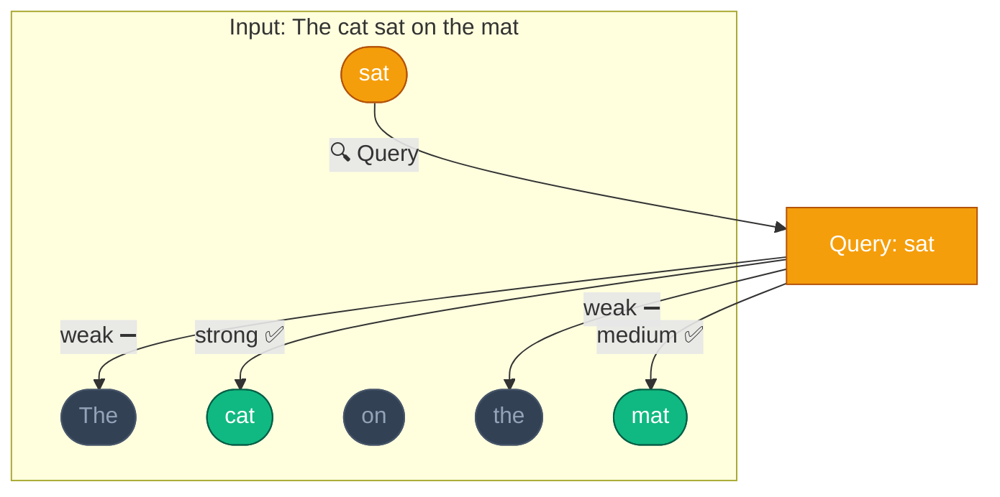
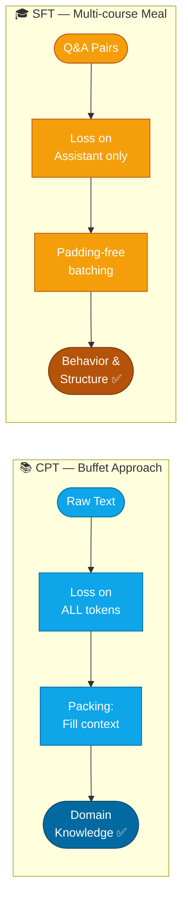
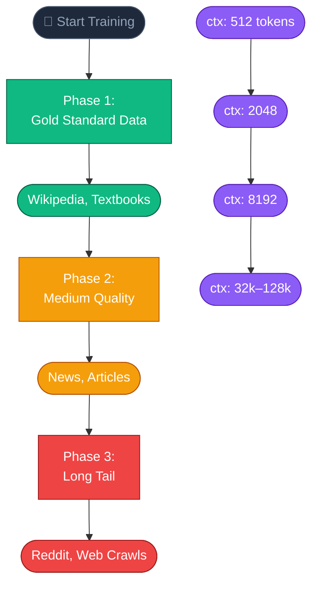
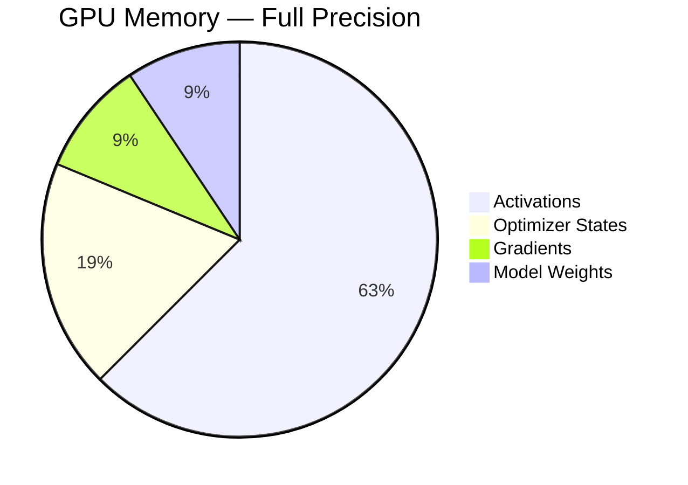
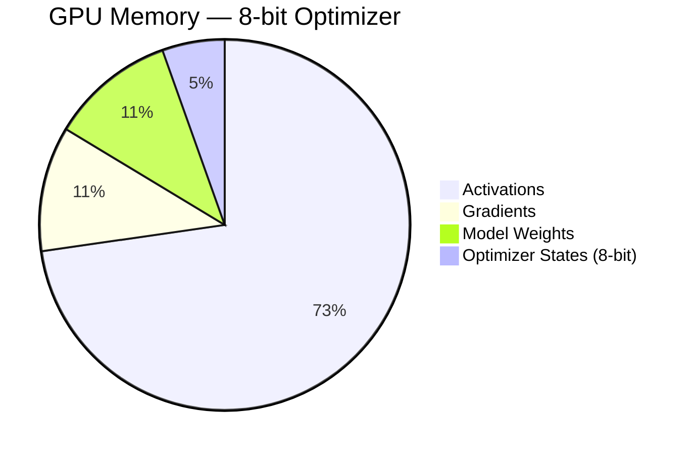

# Week 1: Finetuning Landscape & Continued Pretraining

## Tổng quan

Week 1 giới thiệu nền tảng về kiến trúc Transformer và quy trình training của Large Language Models (LLMs), đặc biệt tập trung vào **Continued Pretraining (CPT)** - giai đoạn đầu tiên trong pipeline finetuning.

## 1. Kiến trúc Transformer

### Pipeline Overview

```mermaid
graph LR
    A(["📄 Raw Text"]):::data
    B["🧠 Pretraining"]:::pretrain
    C(["🤖 Base Model"]):::model
    D["🔬 Continued<br/>Pretraining"]:::pretrain
    E(["🎯 Domain-Adapted<br/>Model"]):::model
    F["🎓 Supervised<br/>Fine-Tuning"]:::sft
    G(["💬 Instruction<br/>Model"]):::model
    H["⚖️ RLHF / Alignment"]:::rl
    I(["🚀 Production<br/>Model"]):::prod

    A --> B --> C --> D --> E --> F --> G --> H --> I

    classDef data     fill:#475569,stroke:#1E293B,color:#fff
    classDef pretrain fill:#0EA5E9,stroke:#0369A1,color:#fff
    classDef model    fill:#1E293B,stroke:#475569,color:#94A3B8
    classDef sft      fill:#F59E0B,stroke:#B45309,color:#fff
    classDef rl       fill:#EF4444,stroke:#991B1B,color:#fff
    classDef prod     fill:#10B981,stroke:#065F46,color:#fff
```



### Lịch sử Attention Mechanism

- **Attention không được phát minh trong paper Transformer!**
- Ban đầu được thiết kế để cải thiện encoder-decoder RNN models cho machine translation
- Giải quyết vấn đề: thay vì nén toàn bộ input thành 1 vector cố định, cho phép model "nhìn lại" các phần khác nhau của input

### Attention Pooling

Cơ chế cơ bản:
- **Keys** (k1, k2, ..., kn): Tập các khóa
- **Values** (v1, v2, ..., vn): Tập các giá trị tương ứng
- **Query**: Thể hiện thông tin đang tìm kiếm

Attention so sánh query với tất cả keys, gán weight cho mỗi key, và tạo weighted sum của values.

### Self-Attention



Mỗi token trong sequence attend to tất cả tokens khác trong cùng sequence:

```
Input: "The cat sat on the mat"

- Mỗi token → Query (Q), Key (K), Value (V)
- Query của mỗi token so sánh với Keys của tất cả tokens
- Tạo weighted sum của Values
```

Ví dụ: token "sat" có thể:
- Attend mạnh đến "cat" (chủ ngữ)
- Attend đến "mat" (địa điểm)
- Ignore "the" (function words)

### Scaled Dot-Product Attention

```
Attention(Q, K, V) = softmax(QK^T / √d_k) * V
```

1. Queries so sánh với Keys bằng dot product
2. Normalize bằng softmax
3. Weighted sum của Values

### Multi-Head Attention

Thay vì 1 attention head, sử dụng nhiều heads song song:
- Mỗi head học các patterns khác nhau
- Short-range vs long-range dependencies
- Syntactic vs semantic relationships

```
MultiHead(Q, K, V) = Concat(head_1, ..., head_h) * W^O
```

### Positional Encoding

Attention không có khái niệm về thứ tự → cần inject positional information:
- Sử dụng sine/cosine functions ở các tần số khác nhau
- Low-frequency: coarse position
- High-frequency: fine-grained differences

## 2. Ba kiến trúc Transformer

```mermaid
graph TB
    subgraph enc["🔵 Encoder-Only (BERT)"]
        direction LR
        E1(["T1"]):::enc <--> E2(["T2"]):::enc
        E2 <--> E3(["T3"]):::enc
        E3 <--> E1
        E1 & E2 & E3 --> O1["Classification"]:::out
    end

    subgraph encdec["🟡 Encoder-Decoder (T5)"]
        direction LR
        ED1["Input Tokens"]:::encdec --> ENC["Encoder"]:::encdec
        ENC --> DEC["Decoder"]:::encdec
        DEC -- "cross-attention" --> ENC
        DEC --> ED2["Output Tokens"]:::out
    end

    subgraph dec["🟢 Decoder-Only (GPT / LLaMA)"]
        direction LR
        D1(["T1"]):::decn --> D2(["T2"]):::decn --> D3(["T3"]):::decn --> D4(["T4"]):::decn
        D4 -. "predict" .-> D5(["Next Token"]):::pred
    end

    classDef enc    fill:#3B82F6,stroke:#1D4ED8,color:#fff
    classDef encdec fill:#F59E0B,stroke:#B45309,color:#fff
    classDef decn   fill:#10B981,stroke:#065F46,color:#fff
    classDef pred   fill:#8B5CF6,stroke:#5B21B6,color:#fff
    classDef out    fill:#1E293B,stroke:#475569,color:#94A3B8
```



### Encoder-Only (BERT)

- Bidirectional self-attention
- Tốt cho: classification, retrieval, semantic similarity
- Không generate text, chỉ encoding
- Pretraining: Masked Language Modeling

### Encoder-Decoder (T5, BART)

- Encoder: đọc và represent input
- Decoder: generate output từng token
- Cross-attention: decoder nhìn vào encoder outputs
- Causal self-attention: không peek future tokens
- Tốt cho: translation, summarization

### Decoder-Only (GPT, LLaMA, Qwen)

- **Kiến trúc của modern LLMs**
- Chỉ có causal self-attention
- Mỗi token chỉ attend to tokens trước nó
- Training objective: predict next token
- Scaling remarkably well

## 3. LLM Training Pipeline

### InstructGPT Framework (2022)

Pipeline 3 giai đoạn chuẩn:

1. **Pretraining**: Large-scale raw text
2. **Supervised Fine-Tuning (SFT)**: High-quality task examples
3. **Alignment (RLHF)**: Reinforcement Learning from Human Feedback

Hoặc view 2 phases:
- **Pretraining**: Build general capabilities
- **Post-training**: Refine, adapt, align

## 4. Pretraining - "Learning the World"

### Causal Language Modeling (CLM)

- Predict next token given previous tokens
- Self-supervised learning
- No labels, no instructions
- Dataset: web pages, books, articles, code

### Base Models

Kết quả của pretraining:
- Excellent at text completion
- Broad language patterns, facts, world knowledge
- **Chưa thể**: follow instructions, refuse requests, optimize for safety
- Powerful but unpredictable (Shoggoth analogy)

### Scaling Laws

Performance cải thiện theo power-law khi tăng:
- Model size (parameters)
- Training data (tokens)
- Training compute

## 5. Continued Pretraining (CPT)

### CPT vs SFT Comparison



### Khi nào dùng CPT?

- Add new domain knowledge (legal, medical, finance)
- Support underrepresented languages
- Data distribution khác với original model

### CPT vs SFT

**CPT (Buffet approach):**
- Raw text, maximize knowledge per FLOP
- Loss calculated on EVERY token
- Packing: concatenate documents into full context (8k-128k tokens)
- Goal: absorb domain knowledge

**SFT (Multi-course meal):**
- Structured Q&A pairs
- Loss ONLY on Assistant tokens (User tokens = -100)
- Padding-free with Flash Attention 2
- Goal: teach behavior and structure

### Curriculum Learning



Organize data by quality/complexity:

1. **Data Quality Sorting**: 
   - Start: Gold Standard (Wikipedia, textbooks)
   - Gradually: Long Tail (Reddit, web crawls)

2. **Sequence Length Scaling**:
   - Start: 512 tokens (local syntax)
   - Gradually: 4k → 8k → 128k (long-range dependencies)

**Benefits:**
- Faster convergence
- Lower final loss
- More robust to noise

### Knowledge Distillation

Transfer intelligence từ large "teacher" model sang small "student":

- Teacher provides soft targets (probability distribution)
- Student learns "Dark Knowledge" (relationships between words)
- Result: 10x smaller, 10x faster, 90% capability
- Chain-of-Thought Distillation: transfer reasoning process

## 6. Hardware & Memory Optimization

### Memory Breakdown Visualization





### Memory Wall

Training memory ≠ Model size:
- Weights: 1.2GB (0.6B params in FP16)
- Gradients: 1.2GB
- Optimizer states: 2.4GB (3-4x weights!)
- Activations: Variable (batch_size × context_length)

### Optimization Techniques

**Mixed Precision (BF16):**
- Range of FP32, memory of FP16
- Faster without FP16 instability

**Gradient Accumulation:**
- Calculate gradients over micro-batches
- Update weights after N steps

**Activation Checkpointing:**
- Discard activations during forward pass
- Re-calculate during backward pass
- Trade: 25% more compute for massive VRAM savings

**Flash Attention 2:**
- Old: Activations grow O(N²) with context length
- New: Linear O(N) scaling
- Requires GPU Compute Capability ≥ 8.0

## 7. Lab 1 Implementation

### Tech Stack

- **Model**: Qwen3-0.6B-Base (small, fast, capable)
- **Dataset**: pritamdeb68/Math-Pretraining-Data
- **Framework**: Unsloth (speed optimization)
- **Trainer**: TRL SFTTrainer
- **Tracking**: Comet.ml

### Key Parameters

```python
model_name = "Qwen/Qwen3-0.6B-Base"
max_seq_length = 1024
batch_size = 4
gradient_accumulation_steps = 4  # Effective batch = 16
learning_rate = 2e-5  # Low LR for full finetuning
optim = "adamw_8bit"  # Save optimizer memory
packing = True  # Critical for CPT
```

### Memory Breakdown (A10G 24GB)

```
Full precision optimizer:
- Weights: 1.2GB
- Gradients: 1.2GB
- Optimizer: 2.4GB
- Activations: ~8GB
Total: ~13GB ✅

8-bit optimizer:
- Weights: 1.2GB
- Gradients: 1.2GB
- Optimizer: 0.6GB (4x smaller!)
- Activations: ~8GB
Total: ~11GB ✅
```

### Running on HF Jobs

```bash
hf jobs uv run \
  --flavor a10g-small \
  --timeout 3h \
  -s COMET_API_KEY="..." \
  -s HF_TOKEN="..." \
  -e COMET_PROJECT_NAME="finetuning-sessions-week1" \
  main.py
```

## Key Takeaways

1. **Attention is all you need** - nhưng cần hiểu cách nó hoạt động
2. **Decoder-only** là kiến trúc của modern LLMs
3. **Pretraining** builds raw intelligence, **finetuning** shapes behavior
4. **CPT** teaches domain knowledge, **SFT** teaches structure
5. **Memory optimization** là critical cho training efficiency
6. **Curriculum Learning** và **Knowledge Distillation** là advanced techniques
7. **Scaling laws** explain why bigger models work better

## References

- [Attention Is All You Need (Vaswani et al., 2017)](https://arxiv.org/pdf/1706.03762)
- [Understanding LSTM Networks (Olah, 2015)](https://colah.github.io/posts/2015-08-Understanding-LSTMs/)
- [Dive into Deep Learning (Zhang et al., 2023)](https://d2l.ai/)
- [Scaling Laws for Neural Language Models (Kaplan et al., 2020)](https://arxiv.org/abs/2001.08361)
- [InstructGPT (OpenAI, 2022)](https://openai.com/index/instruction-following/)
