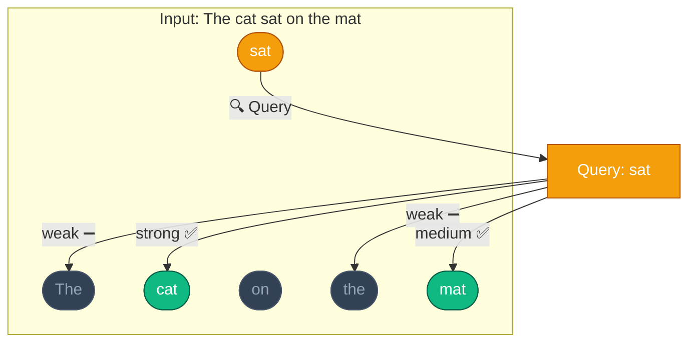
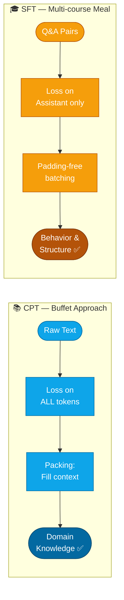
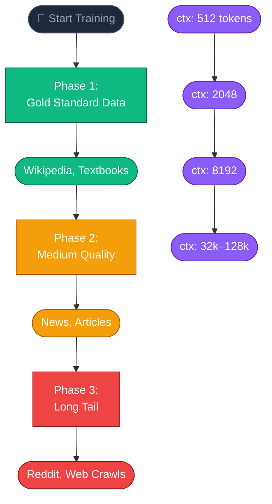
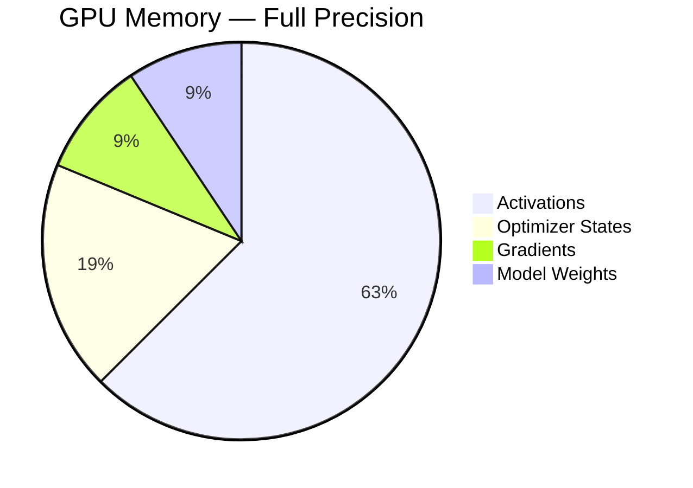
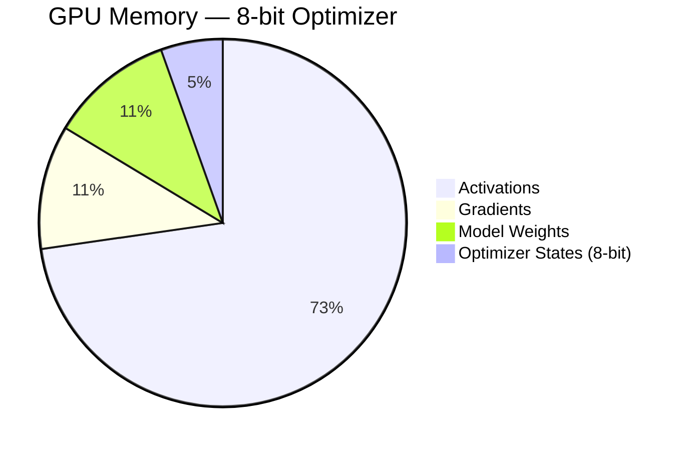

# Week 1: Finetuning Landscape & Continued Pretraining

## Overview

Week 1 lays the foundational understanding of the Transformer architecture and the training pipeline for Large Language Models (LLMs), with particular emphasis on **Continued Pretraining (CPT)** — the first stage in the finetuning pipeline.

## 1. Transformer Architecture

### Pipeline Overview

```mermaid
graph LR
    A(["📄 Raw Text"]):::data
    B["🧠 Pretraining"]:::pretrain
    C(["🤖 Base Model"]):::model
    D["🔬 Continued<br/>Pretraining"]:::pretrain
    E(["🎯 Domain-Adapted<br/>Model"]):::model
    F["🎓 Supervised<br/>Fine-Tuning"]:::sft
    G(["💬 Instruction<br/>Model"]):::model
    H["⚖️ RLHF / Alignment"]:::rl
    I(["🚀 Production<br/>Model"]):::prod

    A --> B --> C --> D --> E --> F --> G --> H --> I

    classDef data     fill:#475569,stroke:#1E293B,color:#fff
    classDef pretrain fill:#0EA5E9,stroke:#0369A1,color:#fff
    classDef model    fill:#1E293B,stroke:#475569,color:#94A3B8
    classDef sft      fill:#F59E0B,stroke:#B45309,color:#fff
    classDef rl       fill:#EF4444,stroke:#991B1B,color:#fff
    classDef prod     fill:#10B981,stroke:#065F46,color:#fff
```



### History of the Attention Mechanism

- **Attention was not invented in the Transformer paper.**
- It was originally designed to improve encoder-decoder RNN models for machine translation.
- The problem it addresses: rather than compressing the entire input into a single fixed-length vector, attention allows the model to "look back" at different parts of the input as needed.

### Attention Pooling

The fundamental mechanism:
- **Keys** (k1, k2, ..., kn): A set of keys
- **Values** (v1, v2, ..., vn): A set of corresponding values
- **Query**: Represents the information being sought

Attention compares the query against all keys, assigns a weight to each key, and produces a weighted sum of the values.

### Self-Attention



Each token in the sequence attends to all other tokens within the same sequence:

```
Input: "The cat sat on the mat"

- Each token → Query (Q), Key (K), Value (V)
- Each token's Query is compared with Keys of all tokens
- Produces a weighted sum of Values
```

For instance, the token "sat" might:
- Attend strongly to "cat" (the subject)
- Attend to "mat" (the location)
- Ignore "the" (function words)

### Scaled Dot-Product Attention

```
Attention(Q, K, V) = softmax(QK^T / √d_k) * V
```

1. Queries are compared against Keys via dot product
2. Scores are normalized using softmax
3. A weighted sum of Values is computed

### Multi-Head Attention

Rather than a single attention head, multiple heads operate in parallel:
- Each head learns distinct patterns
- Short-range vs long-range dependencies
- Syntactic vs semantic relationships

```
MultiHead(Q, K, V) = Concat(head_1, ..., head_h) * W^O
```

### Positional Encoding

Attention has no inherent notion of token order, making positional information injection necessary:
- Sine and cosine functions at varying frequencies are employed
- Low-frequency components encode coarse positional information
- High-frequency components capture fine-grained positional differences

## 2. Three Transformer Architectures

```mermaid
graph TB
    subgraph enc["🔵 Encoder-Only (BERT)"]
        direction LR
        E1(["T1"]):::enc <--> E2(["T2"]):::enc
        E2 <--> E3(["T3"]):::enc
        E3 <--> E1
        E1 & E2 & E3 --> O1["Classification"]:::out
    end

    subgraph encdec["🟡 Encoder-Decoder (T5)"]
        direction LR
        ED1["Input Tokens"]:::encdec --> ENC["Encoder"]:::encdec
        ENC --> DEC["Decoder"]:::encdec
        DEC -- "cross-attention" --> ENC
        DEC --> ED2["Output Tokens"]:::out
    end

    subgraph dec["🟢 Decoder-Only (GPT / LLaMA)"]
        direction LR
        D1(["T1"]):::decn --> D2(["T2"]):::decn --> D3(["T3"]):::decn --> D4(["T4"]):::decn
        D4 -. "predict" .-> D5(["Next Token"]):::pred
    end

    classDef enc    fill:#3B82F6,stroke:#1D4ED8,color:#fff
    classDef encdec fill:#F59E0B,stroke:#B45309,color:#fff
    classDef decn   fill:#10B981,stroke:#065F46,color:#fff
    classDef pred   fill:#8B5CF6,stroke:#5B21B6,color:#fff
    classDef out    fill:#1E293B,stroke:#475569,color:#94A3B8
```



### Encoder-Only (BERT)

- Bidirectional self-attention
- Well-suited for: classification, retrieval, semantic similarity
- Does not generate text; performs encoding only
- Pretraining: Masked Language Modeling

### Encoder-Decoder (T5, BART)

- Encoder: reads and represents the input
- Decoder: generates output token by token
- Cross-attention: the decoder attends to encoder outputs
- Causal self-attention: prevents the decoder from attending to future tokens
- Well-suited for: translation, summarization

### Decoder-Only (GPT, LLaMA, Qwen)

- **The architecture underlying modern LLMs**
- Employs only causal self-attention
- Each token attends exclusively to preceding tokens
- Training objective: next-token prediction
- Scales remarkably well with increased parameters and data

## 3. LLM Training Pipeline

### InstructGPT Framework (2022)

The standard three-stage pipeline:

1. **Pretraining**: Large-scale raw text
2. **Supervised Fine-Tuning (SFT)**: High-quality task examples
3. **Alignment (RLHF)**: Reinforcement Learning from Human Feedback

Alternatively, viewed as two phases:
- **Pretraining**: Build general capabilities
- **Post-training**: Refine, adapt, align

## 4. Pretraining — "Learning the World"

### Causal Language Modeling (CLM)

- Predict the next token given all preceding tokens
- Self-supervised learning — no manual labels required
- No labels, no instructions
- Dataset: web pages, books, articles, code

### Base Models

The product of pretraining:
- Excellent at text completion
- Broad language patterns, facts, and world knowledge
- **Not yet capable of**: following instructions, refusing requests, optimizing for safety
- Powerful but unpredictable (the Shoggoth analogy)

### Scaling Laws

Performance improves following a power-law relationship as one increases:
- Model size (parameters)
- Training data (tokens)
- Training compute

## 5. Continued Pretraining (CPT)

### CPT vs SFT Comparison



### When to Use CPT?

- When the model needs new domain-specific knowledge (legal, medical, finance)
- When supporting underrepresented languages
- When the data distribution differs substantially from the original training data

### CPT vs SFT

**CPT (Buffet approach):**
- Raw text, maximizing knowledge absorption per FLOP
- Loss calculated on every token
- Packing: concatenate documents to fill the full context window (8k–128k tokens)
- Goal: absorb domain knowledge

**SFT (Multi-course meal):**
- Structured question-and-answer pairs
- Loss computed only on Assistant tokens (User tokens masked with -100)
- Padding-free batching with Flash Attention 2
- Goal: teach behavioral patterns and output structure

### Curriculum Learning



Organize data by quality and complexity:

1. **Data Quality Sorting**:
   - Begin with: Gold Standard (Wikipedia, textbooks)
   - Gradually introduce: Long Tail (Reddit, web crawls)

2. **Sequence Length Scaling**:
   - Begin with: 512 tokens (capturing local syntax)
   - Gradually increase: 4k → 8k → 128k (modeling long-range dependencies)

**Benefits:**
- Faster convergence
- Lower final loss
- Greater robustness to noise

### Knowledge Distillation

Transferring intelligence from a large "teacher" model to a compact "student" model:

- The teacher provides soft targets (probability distributions over the vocabulary)
- The student learns "Dark Knowledge" — the relational structure between tokens, not merely the correct answer
- Result: a model 10× smaller and 10× faster while retaining approximately 90% of the teacher's capability
- Chain-of-Thought Distillation: transfers the reasoning process itself, not just the final output

## 6. Hardware & Memory Optimization

### Memory Breakdown Visualization





### Memory Wall

Training memory requirements far exceed the model's parameter count:
- Weights: 1.2GB (0.6B parameters in FP16)
- Gradients: 1.2GB
- Optimizer states: 2.4GB (3–4× the weight memory)
- Activations: Variable (scales with batch_size × context_length)

### Optimization Techniques

**Mixed Precision (BF16):**
- Combines the dynamic range of FP32 with the memory footprint of FP16
- Faster training without the numerical instability inherent to FP16

**Gradient Accumulation:**
- Computes gradients over successive micro-batches
- Updates weights once every N steps, simulating a larger effective batch size

**Activation Checkpointing:**
- Discards intermediate activations during the forward pass
- Recomputes them as needed during the backward pass
- Trade-off: approximately 25% additional compute for substantial VRAM savings

**Flash Attention 2:**
- Previously: activation memory scaled as O(N²) with context length
- Now: linear O(N) scaling
- Requires GPU Compute Capability ≥ 8.0 (Ampere architecture and above)

## 7. Lab 1 Implementation

### Tech Stack

- **Model**: Qwen3-0.6B-Base (compact, efficient, capable)
- **Dataset**: pritamdeb68/Math-Pretraining-Data
- **Framework**: Unsloth (training acceleration)
- **Trainer**: TRL SFTTrainer
- **Tracking**: Comet.ml

### Key Parameters

```python
model_name = "Qwen/Qwen3-0.6B-Base"
max_seq_length = 1024
batch_size = 4
gradient_accumulation_steps = 4  # Effective batch = 16
learning_rate = 2e-5  # Low LR for full finetuning
optim = "adamw_8bit"  # Save optimizer memory
packing = True  # Critical for CPT
```

### Memory Breakdown (A10G 24GB)

```
Full precision optimizer:
- Weights: 1.2GB
- Gradients: 1.2GB
- Optimizer: 2.4GB
- Activations: ~8GB
Total: ~13GB ✅

8-bit optimizer:
- Weights: 1.2GB
- Gradients: 1.2GB
- Optimizer: 0.6GB (4x smaller!)
- Activations: ~8GB
Total: ~11GB ✅
```

### Running on HF Jobs

```bash
hf jobs uv run \
  --flavor a10g-small \
  --timeout 3h \
  -s COMET_API_KEY="..." \
  -s HF_TOKEN="..." \
  -e COMET_PROJECT_NAME="finetuning-sessions-week1" \
  main.py
```

## Key Takeaways

1. **Attention is all you need** — but understanding its inner workings is essential
2. **Decoder-only** is the predominant architecture of modern LLMs
3. **Pretraining** builds raw intelligence; **finetuning** shapes behavior
4. **CPT** imparts domain knowledge; **SFT** instills structure
5. **Memory optimization** is critical for training efficiency
6. **Curriculum Learning** and **Knowledge Distillation** are powerful advanced techniques
7. **Scaling laws** explain why larger models consistently achieve better performance

## References

- [Attention Is All You Need (Vaswani et al., 2017)](https://arxiv.org/pdf/1706.03762)
- [Understanding LSTM Networks (Olah, 2015)](https://colah.github.io/posts/2015-08-Understanding-LSTMs/)
- [Dive into Deep Learning (Zhang et al., 2023)](https://d2l.ai/)
- [Scaling Laws for Neural Language Models (Kaplan et al., 2020)](https://arxiv.org/abs/2001.08361)
- [InstructGPT (OpenAI, 2022)](https://openai.com/index/instruction-following/)
