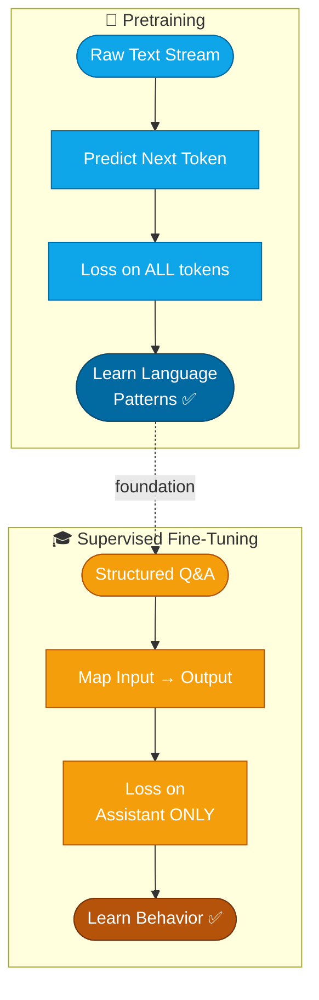
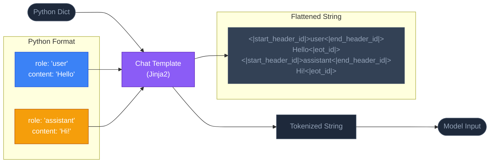
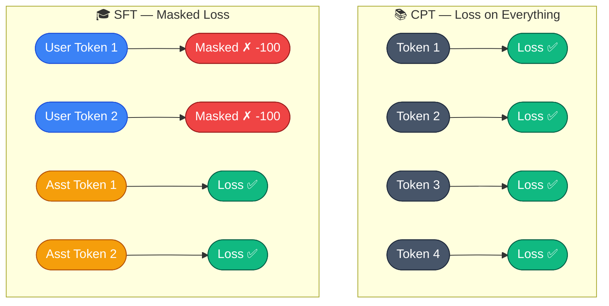
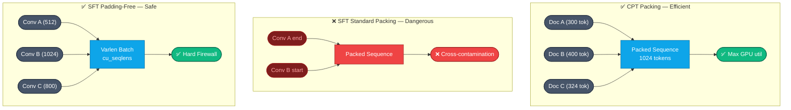
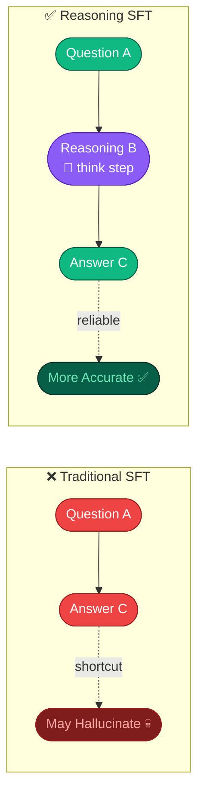
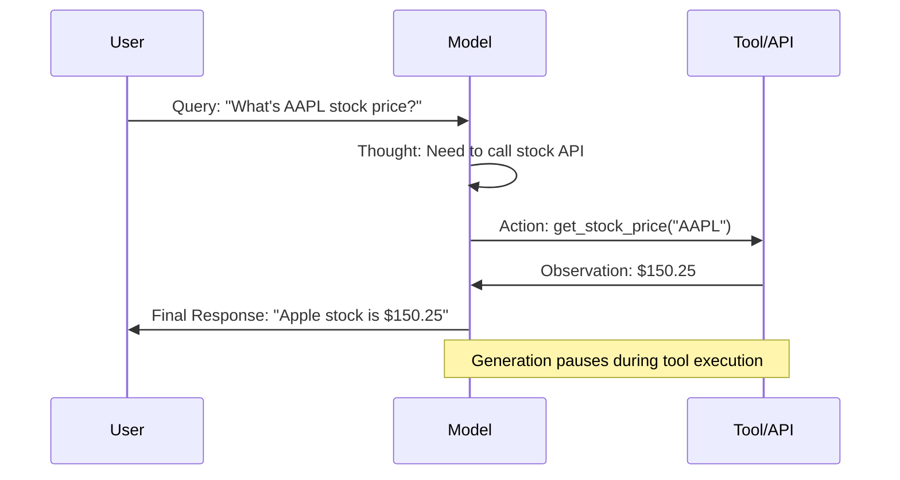
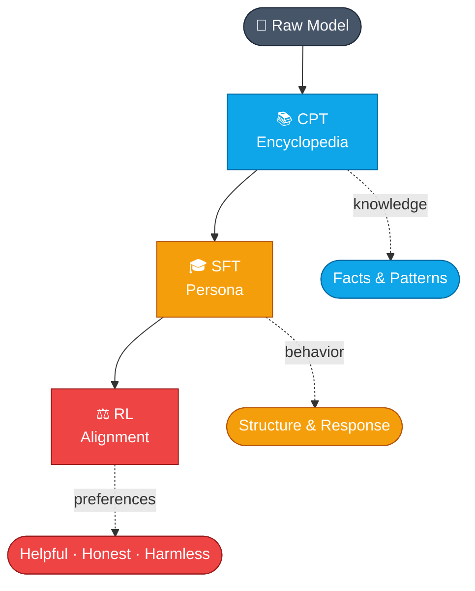

# Week 2: Supervised Fine-Tuning (SFT) - The Engineer's Guide

## Tổng quan

Week 2 tập trung vào **Supervised Fine-Tuning (SFT)** - giai đoạn dạy model cách **behave** và **respond** có cấu trúc, không phải thêm knowledge mới.

> **Core Insight**: SFT không phải về adding knowledge, mà về **changing behavior**!

## 1. SFT vs Pretraining

### Training Pipeline Comparison



### Pretraining: Learning Language

- Objective: Predict next token
- Data: Massive, uninterrupted flow of text
- Result: Model learns patterns, facts, world knowledge
- Problem: Không biết khi nào dừng, không có sense of turn-taking

### SFT: Learning Structure

- Objective: Map input → structured output
- Data: High-quality Q&A pairs với roles
- Result: Model learns conversation structure
- Key: Introduces **roles**, **boundaries**, **turn-taking**

### Shoggoth Analogy

- **Pretraining**: Raw pattern-learning engine (Shoggoth)
- **SFT**: Adds structure and alignment (smiley face mask)
- Power is there, behavior becomes predictable

## 2. Chat Templates - The Structural Backbone

### Template Architecture



### Vấn đề cơ bản

Transformer không có built-in concept of "speaker" hay "listener" → cần **chat template** để tạo structure.

### Chat Template là gì?

Translation layer giữa:
- **Input**: Python list `[{role: "user", content: "..."}, {role: "assistant", content: "..."}]`
- **Output**: Single flattened string mà model thực sự thấy

### Ví dụ: Qwen3 Chat Template

```
<|start_header_id|>user<|end_header_id|>
What is the capital of France?
<|eot_id|>

<|start_header_id|>assistant<|end_header_id|>
The capital of France is Paris.
<|eot_id|>
```

### Special Tokens

- `<|start_header_id|>`, `<|end_header_id|>`: Đánh dấu role
- `<|eot_id|>`: End of turn
- `<think>`, `</think>`: Protected space for reasoning
- `<|tool_call|>`, `<|tool_response|>`: API interactions

### Jinja2 Templates - The Implementation

Chat templates thường được viết bằng **Jinja2** - một template engine cho Python.

**Tại sao dùng Jinja2?**
- Flexible: Hỗ trợ loops, conditionals, filters
- Readable: Syntax gần với Python
- Standard: Được Hugging Face sử dụng rộng rãi

**Ví dụ Qwen3 Chat Template (Jinja2):**

```jinja2

    
        <|start_header_id|>system<|end_header_id|>
        {{ message['content'] }}<|eot_id|>
    
        <|start_header_id|>user<|end_header_id|>
        {{ message['content'] }}<|eot_id|>
    
        <|start_header_id|>assistant<|end_header_id|>
        {{ message['content'] }}<|eot_id|>
    

```

**Jinja2 Syntax Breakdown:**

```jinja2
           # Control structures (if, for, etc)
{{ variable }}      # Variable substitution
{# comment #}       # Comments (ignored)
| filter           # Apply filters (e.g., {{ text | trim }})
```

**Ví dụ với conditionals:**

```jinja2

    <|tool_call|>
    {{ message['tool_calls'] | tojson }}
    <|eot_id|>

    {{ message['content'] }}

```

**Ví dụ với loops:**

```jinja2

    <|tool_call|>
    {
        "name": "{{ tool_call['function']['name'] }}",
        "arguments": {{ tool_call['function']['arguments'] | tojson }}
    }
    <|eot_id|>

```

**Common Jinja2 Filters trong Chat Templates:**

- `| tojson`: Convert Python object → JSON string
- `| trim`: Remove whitespace
- `| length`: Get length of list/string
- `| default('value')`: Provide default if None

**Xem Chat Template của model:**

```python
from transformers import AutoTokenizer

tokenizer = AutoTokenizer.from_pretrained("Qwen/Qwen2.5-7B-Instruct")

# Print raw Jinja2 template
print(tokenizer.chat_template)

# Apply template to messages
messages = [
    {"role": "user", "content": "Hello!"},
    {"role": "assistant", "content": "Hi there!"}
]

formatted = tokenizer.apply_chat_template(
    messages, 
    tokenize=False,  # Return string, not tokens
    add_generation_prompt=False
)
print(formatted)
```

**Output:**
```
<|start_header_id|>user<|end_header_id|>
Hello!<|eot_id|>
<|start_header_id|>assistant<|end_header_id|>
Hi there!<|eot_id|>
```

**Custom Chat Template:**

Bạn có thể override template nếu cần:

```python
custom_template = """

[{{ message['role'].upper() }}]: {{ message['content'] }}

"""

tokenizer.chat_template = custom_template

formatted = tokenizer.apply_chat_template(messages, tokenize=False)
print(formatted)
# Output:
# [USER]: Hello!
# [ASSISTANT]: Hi there!
```

**Advanced: Tool Calling Template:**

```jinja2

    
        <|start_header_id|>user<|end_header_id|>
        {{ message['content'] }}<|eot_id|>
    
        <|start_header_id|>assistant<|end_header_id|>
        
        {# Check if assistant made tool calls #}
        
            
                <|tool_call|>
                {{ tool_call | tojson }}
                <|eot_id|>
            
        
            {{ message['content'] }}<|eot_id|>
        
    
        <|start_header_id|>tool<|end_header_id|>
        {{ message['content'] }}<|eot_id|>
    


{# Add generation prompt if needed #}

    <|start_header_id|>assistant<|end_header_id|>

```

**Debugging Tips:**

```python
# 1. Check if template exists
if tokenizer.chat_template is None:
    print("⚠️ No chat template found!")

# 2. Validate template syntax
try:
    from jinja2 import Template
    Template(tokenizer.chat_template)
    print("✅ Template syntax valid")
except Exception as e:
    print(f"❌ Template error: {e}")

# 3. Test with sample messages
test_messages = [
    {"role": "system", "content": "You are helpful."},
    {"role": "user", "content": "Hi"},
    {"role": "assistant", "content": "Hello!"}
]

result = tokenizer.apply_chat_template(
    test_messages, 
    tokenize=False,
    add_generation_prompt=True
)
print(result)
```

**Common Pitfalls:**

1. **Missing `add_generation_prompt`**: Khi inference, cần set `True` để model biết bắt đầu generate
2. **Whitespace issues**: Jinja2 có thể thêm extra spaces → dùng `` để strip
3. **Special token mismatch**: Đảm bảo special tokens trong template match với `tokenizer.special_tokens_map`

```python
# Check special tokens
print(tokenizer.special_tokens_map)
# {'bos_token': '<|begin_of_text|>', 
#  'eos_token': '<|end_of_text|>', ...}
```

### Critical Rules

1. **Template consistency**: Phải dùng cùng template cho training và inference
2. **Stored in**: `tokenizer_config.json` (Jinja2 format)
3. **Mismatch symptoms**: Confused responses, broken tool calls, model answering for user
4. **Always validate**: Test template với sample messages trước khi train
5. **Version control**: Save template cùng với model checkpoint

## 3. Loss Masking - The Critical Divergence

### Loss Calculation Visualization



### CPT: Loss on Everything

```python
# Calculate loss on EVERY token
loss = calculate_loss(all_tokens)
```

### SFT: Loss ONLY on Assistant

```python
# User tokens → -100 (ignore_index)
labels = input_ids.clone()
labels[user_token_positions] = -100

# PyTorch CrossEntropyLoss ignores -100
loss = CrossEntropyLoss()(logits, labels)
```

**Why?**
- Model processes User prompt for context
- But only learns to PREDICT Assistant response
- Prevents model from learning to predict user questions

### Shift-Right Setup

- Causal LM always predicts NEXT token
- Loss on final user token = ability to predict FIRST assistant token
- Boundary transition is critical for response initiation

## 4. Packing Paradox

### Packing Strategy Comparison



### CPT Packing (Good)

```
[Doc A][Doc B][Doc C] → Fill entire 8k context
```
- Maximize GPU utilization
- Efficient for raw text

### SFT Packing (Dangerous)

```
[Conv A end][Conv B start] → Cross-contamination!
```
- Attention can leak between conversations
- Model confuses contexts

### Solution: Padding-Free SFT

**Flash Attention 2 + Variable Length (Varlen):**
- Pass `cu_seqlens` (cumulative sequence lengths) tensor
- Process multiple conversations simultaneously
- Hard firewall between conversations
- No wasted compute on padding zeros

```python
# Example
cu_seqlens = [0, 512, 1024, 1800]  # 3 conversations
# Conv 1: tokens 0-512
# Conv 2: tokens 512-1024
# Conv 3: tokens 1024-1800
```

## 5. Data Quality > Data Quantity

### LIMA Paper Insight

**Less Is More for Alignment:**
- 1,000 curated examples > 10,000 noisy examples
- Quality matters more than scale in SFT

### Strong SFT Dataset Composition

Balanced mixture:
- Mathematical reasoning (sharpen logic)
- High-quality code (reinforce structure)
- Conversational examples (shape tone/persona)
- Safety-aligned samples (anchor behavior)

### Modern Approach: Synthetic Pipelines

Instead of scraping:
1. Generate examples using strong teacher models
2. Filter aggressively
3. Goal: **density** over quantity

## 6. Reasoning-Focused SFT

### Reasoning Path Comparison



### Traditional SFT

```
Question → Answer (A → C)
```
- Model learns to jump directly
- Encourages shortcuts
- Hallucinations creep in

### Reasoning SFT

```
Question → Reasoning Trace → Answer (A → B → C)
```
- Middle step B = visible thinking process
- Model learns the PROCESS, not just the answer

### Using `<think>` Tags

```
<|start_header_id|>user<|end_header_id|>
What is 15 × 23?
<|eot_id|>

<|start_header_id|>assistant<|end_header_id|>
<think>
Let me break this down:
15 × 23 = 15 × (20 + 3)
= (15 × 20) + (15 × 3)
= 300 + 45
= 345
</think>

The answer is 345.
<|eot_id|>
```

### DeepSeek-R1 Approach

1. **Cold Start SFT**: Seed reasoning behavior with high-quality CoT data
2. **RL Refinement**: Reward correct derivations, discourage shortcuts

**Key**: RL cannot invent reasoning from scratch → SFT must seed it first!

## 7. Agentic SFT - Teaching Models to "Do"

### Agentic Execution Flow



### Agentic Loop Structure

```
Thought → Action → Action Input → Observation → Final Response
```

### Tool Calling Format

```json
<|tool_call|>
{
  "name": "get_stock_price",
  "arguments": {
    "ticker": "AAPL"
  }
}
<|eot_id|>
```

### Critical Requirements

1. **Format discipline**: JSON syntax must be perfect
2. **Schema consistency**: Model must internalize exact format
3. **Clean traces**: Often synthetic, carefully constructed
4. **Execution loop**: Generation pauses → tool executes → result fed back

### Evolution

From closed knowledge system → agent operating in environment

## 8. Implementation Details

### Gradient Spikes

**Problem**: Sudden transition từ ignored tokens (-100) sang active labels
- First assistant tokens carry disproportionately high loss
- Can destabilize training

**Solution**:
- Lower learning rate (1e-5 to 5e-5)
- Warmup schedule
- Ease model into boundary updates

### Batching Strategy

**CPT**: Constant packing (aggressive)
**SFT**: Grouped batching
- Sequences of similar lengths batched together
- Reduce padding while preserving conversation boundaries
- Trade throughput for structural integrity

### Training Arguments

```python
TrainingArguments(
    per_device_train_batch_size=4,
    gradient_accumulation_steps=4,
    learning_rate=2e-5,  # Lower than CPT
    warmup_steps=100,
    bf16=True,
    optim="adamw_8bit",
    logging_steps=20,
    report_to=["comet_ml"],
)
```

### SFTTrainer Configuration

```python
SFTTrainer(
    model=model,
    tokenizer=tokenizer,
    train_dataset=dataset,
    dataset_text_field="messages",  # Column with conversations
    max_seq_length=max_seq_length,
    packing=False,  # Usually False for SFT
    args=training_args,
)
```

## 9. Evaluation - Beyond Loss

### Why Loss Isn't Enough

- Very low loss = overfitting
- Model memorizes phrasing, not intent
- "Polished parrot" 🦜

### Modern Evaluation Methods

**LLM-as-a-Judge:**
- Stronger "teacher" model grades outputs
- Score: clarity, tone, helpfulness, constraint-following
- Check intent capture, not token reproduction

**Instruction-Following Benchmarks:**
- **IFEval**: Strict constraints (word limits, avoid letters)
- Balance fluency with rule compliance

**Agentic Benchmarks:**
- **GAIA**: Real-world assistant tasks (book flight, find data in PDF)
- **SWE-bench**: Resolve GitHub issues, provide code patches
- **WebShop/Mind2Web**: Web navigation, autonomous browsing

### Leaderboards

- [Artificial Analysis Leaderboards](https://artificialanalysis.ai/leaderboards/models)
- Measure alignment, not just accuracy
- Helpfulness, honesty, harmlessness (HHH)

## 10. Common Misconceptions

### Training Pipeline Layers



### "Instruct Models" vs "Reasoning Models"

- **Not different species!**
- SFT is a training step, not a model type
- Difference comes from DATA, not algorithm

### "RL Makes Models Think"

- **Wrong framing!**
- SFT teaches structure of reasoning
- RL refines and reinforces good behavior
- RL cannot invent reasoning from scratch

### Training Pipeline Layers

1. **CPT**: Builds encyclopedia (knowledge)
2. **SFT**: Shapes persona (behavior)
3. **RL**: Refines alignment (preferences)

Each builds on previous → move from patterns to aligned behavior

## 11. Lab 2 Preview

### Experiment Design

Train 2 models on same dataset:
1. **Without reasoning traces**: Direct Q→A
2. **With reasoning traces**: Q→Reasoning→A

### Deliverables

- Breakdown of Qwen3 chat template
- Synthetic dataset with/without CoT
- Deploy both models
- Evaluate using Comet
- Compare behavior side-by-side

### Expected Results

- Model 1: Jumps to answer (may hallucinate)
- Model 2: Reasons through problem (more reliable)

## Key Takeaways

1. **SFT changes behavior, not knowledge** - structure over facts
2. **Chat templates are critical** - consistency between train/inference
3. **Loss masking** - only learn from assistant tokens
4. **Packing paradox** - efficient in CPT, dangerous in SFT
5. **Quality > Quantity** - LIMA showed 1k curated > 10k noisy
6. **Reasoning must be seeded** - RL cannot invent it
7. **Agentic SFT** - teach format discipline for tool calling
8. **Evaluation beyond loss** - LLM-as-judge, instruction-following benchmarks
9. **Gradient management** - lower LR, warmup for boundary transitions
10. **SFT is precision work** - alignment, not just accuracy

## References

- [LIMA: Less Is More for Alignment](https://arxiv.org/pdf/2305.11206)
- [DeepSeek-R1 Paper](https://arxiv.org/pdf/2501.12948)
- [Hugging Face Chat Templating](https://huggingface.co/docs/transformers/chat_templating)
- [IFEval Benchmark](https://arxiv.org/abs/2311.07911)
- [GAIA Benchmark](https://huggingface.co/gaia-benchmark)
- [SWE-bench](https://www.swebench.com/)
