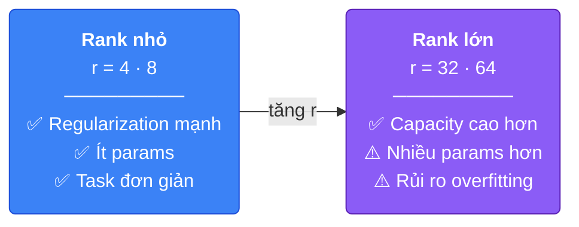
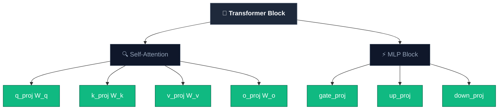
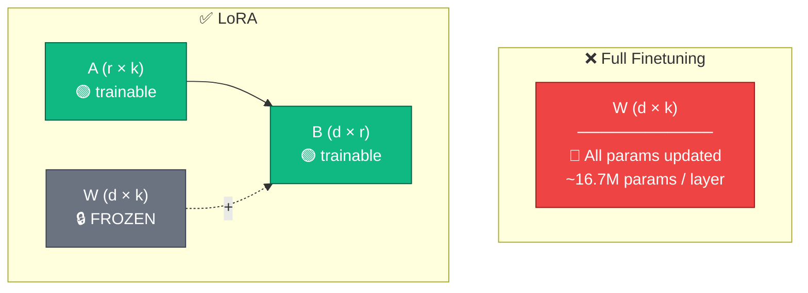

# Week 3 — LoRA: Low-Rank Adaptation

> Nguồn tham khảo chính: [Understanding LoRA from First Principles](https://theneuralmaze.substack.com/p/understanding-lora-from-first-principles) · [LoRA Paper (Hu et al., 2021)](https://arxiv.org/pdf/2106.09685)

---

## 1. Tại sao LoRA quan trọng? (Why LoRA Matters)

**LoRA = Low-Rank Adaptation**

- Từ một **research trick** → trở thành **industry standard**
- Là phương pháp mặc định cho efficient finetuning (**PEFT** — Parameter-Efficient Fine-Tuning)
- Hầu hết tutorials chỉ dạy gọi `get_peft_model(r=16)` mà không giải thích tại sao low-rank lại hoạt động

> 👉 Để hiểu LoRA, ta cần quay về **first principles**: Models are weight matrices — change the weights → change behavior. Vậy câu hỏi là: **có cách nào thay đổi weights hiệu quả hơn không?**

Câu trả lời ngắn: có — vì full finetuning quá đắt, và ta không cần update *toàn bộ* weights.

Khi finetune một LLM lớn (ví dụ 70B parameters), ta cần lưu trữ đồng thời:
- Gradients của toàn bộ weights
- Optimizer states (ví dụ Adam cần 2 moment vectors cho mỗi parameter)
- Bản thân các updated parameters

Với mô hình 70B, chỉ riêng optimizer states đã chiếm hàng trăm GB VRAM — vượt xa khả năng của hầu hết GPU thông thường.

Ngoài ra, full finetuning còn có nguy cơ **catastrophic forgetting**: khi train trên một domain hẹp (ví dụ medical coding), gradient có thể ghi đè lên kiến thức tổng quát mà mô hình đã học được trong pretraining.

```
Vấn đề của Full Finetuning:
┌─────────────────────────────────────────┐
│  Chi phí bộ nhớ = params + grads + opt  │
│  70B model ≈ 140GB (fp16) + ~560GB opt  │
│                                         │
│  Catastrophic forgetting khi domain hẹp │
└─────────────────────────────────────────┘
```

---

## 2. PEFT — Parameter-Efficient Fine-Tuning

### PEFT là gì?

PEFT là một nhóm các phương pháp cho phép finetune LLM mà **chỉ cần train một phần rất nhỏ parameters** (thường <1%), thay vì update toàn bộ weights như full finetuning.

Vấn đề PEFT giải quyết:
- Full finetuning model 7B+ cần hàng chục GB VRAM chỉ cho gradients + optimizer states
- Mỗi task cần lưu một bản copy đầy đủ của model → tốn storage
- Rủi ro catastrophic forgetting cao khi update toàn bộ weights

### Các phương pháp PEFT phổ biến

| Phương pháp | Ý tưởng | Trainable params |
|---|---|---|
| **LoRA** | Inject low-rank matrices A, B song song với W gốc | ~0.1–1% |
| **QLoRA** | LoRA + 4-bit quantization base model | ~0.1–1% (VRAM thấp hơn) |
| **Prefix Tuning** | Thêm learnable prefix tokens vào input | Rất ít |
| **Prompt Tuning** | Thêm soft prompt embeddings | Rất ít |
| **Adapters** | Thêm small bottleneck layers giữa các Transformer layers | ~1–3% |

> 👉 **LoRA là phương pháp PEFT phổ biến nhất hiện nay** — cân bằng tốt giữa hiệu quả, performance, và dễ sử dụng.

### `get_peft_model` — Biến base model thành PEFT model

Trong thực tế, hàm `get_peft_model` (từ Hugging Face PEFT library, hoặc Unsloth wrapper) thực hiện 3 việc:

1. **Freeze toàn bộ weights gốc W** — W không còn nhận gradient
2. **Tạo ma trận A và B** (LoRA adapters) cho mỗi target module được chỉ định
3. **Gắn A, B song song với W** — output trở thành `W·x + (α/r)·B·A·x`

```
Trước get_peft_model:
  x → W·x                    (toàn bộ W trainable)

Sau get_peft_model:
  x → W·x + (α/r)·B·A·x     (W frozen, chỉ A và B trainable)
```

Khi gọi `trainer.train()` sau đó, chỉ có A và B được update — W gốc hoàn toàn không bị thay đổi. Đây là lý do LoRA tiết kiệm VRAM và giảm rủi ro catastrophic forgetting.

### Lợi ích thực tế của PEFT/LoRA

- **Modularity**: Train nhiều adapter cho nhiều task, dùng chung 1 base model
- **Storage**: Mỗi adapter chỉ ~50-100MB thay vì hàng GB cho full model
- **Merge**: Sau training có thể merge adapter vào base model: `W' = W + (α/r)·B·A` → inference không có overhead
- **Swap**: Đổi task chỉ cần đổi adapter file, không cần load lại model

---

## 3. The Transformer Landscape — Bối cảnh kiến trúc

Trước khi đi sâu vào LoRA, cần hiểu bối cảnh: LoRA được áp dụng lên Transformer — kiến trúc nền tảng của hầu hết LLM hiện đại.

### Ba kiến trúc Transformer cốt lõi

| Kiến trúc | Chức năng | Ví dụ |
|---|---|---|
| **Encoder-only** | Understanding & representation | BERT, RoBERTa |
| **Decoder-only** | Autoregressive generation (LLMs) | GPT, LLaMA, Qwen |
| **Encoder-Decoder** | Structured transformation (e.g., translation) | T5, BART |

> 👉 **Most modern large models live here** — kiến trúc Decoder-only là nền tảng của hầu hết LLM hiện tại (GPT-4, LLaMA, Qwen, Mistral...).

LoRA hoạt động bằng cách inject adapter vào các linear projection layers bên trong các Transformer block này.

---

## 4. The Autoencoder Intuition — Tại sao LoRA hoạt động?

To understand why **LoRA** works, shift perspective — hãy nhìn từ góc độ **autoencoder**.

**Autoencoder:**
- **Encoder** → compress dữ liệu chiều cao vào **low-dimensional latent space**
- **Decoder** → reconstruct lại input gốc từ latent space


**Core insight: High-dimensional information can live in a lower-dimensional space.**

Autoencoder chứng minh rằng dữ liệu chiều cao (ví dụ ảnh 784 pixels) thường có thể được nén vào một latent space nhỏ hơn rất nhiều (ví dụ 32 dimensions) mà vẫn giữ được cấu trúc thiết yếu. Decoder có thể reconstruct lại gần như nguyên vẹn từ biểu diễn nén này.

Điều này cho thấy: **thông tin thực sự hữu ích không cần toàn bộ chiều không gian ban đầu** — nó tập trung trong một subspace nhỏ hơn.

> 👉 **LoRA applies this idea to weight updates during finetuning.**

Thay vì học một `ΔW` dày đặc (dense) trong toàn bộ không gian `d × k`, LoRA giả định rằng sự thay đổi cần thiết trong weights cũng nằm trong một **subspace chiều thấp** — giống như cách autoencoder nén dữ liệu vào latent space.

> Giả thuyết intrinsic rank: `ΔW` thực ra nằm trong một **subspace chiều thấp**, dù `W` ban đầu có chiều rất cao.

---

## 5. The RecSys Intuition — SVD và Matrix Factorization

Một trực giác mạnh mẽ khác đến từ **Recommender Systems** — cụ thể là kỹ thuật **Singular Value Decomposition (SVD)** dùng trong matrix factorization.

### SVD là gì?

SVD phân rã một ma trận lớn thành tích của các ma trận nhỏ hơn. Ý tưởng: **không phải mọi thông tin trong ma trận đều quan trọng** — phần lớn cấu trúc có thể được capture bởi một vài "chiều ẩn" (latent dimensions).

### Ví dụ: User–Item Matrix trong Recommender Systems

Tưởng tượng một ma trận rating phim:

```
              Movie1  Movie2  Movie3  ...  Movie_m
User1         [  4       ?       3    ...    ?   ]
User2         [  ?       5       ?    ...    2   ]
User3         [  3       ?       4    ...    ?   ]
...
User_n        [  ?       2       ?    ...    5   ]

→ Ma trận R (n × m) — sparse, rất nhiều ô trống
```

SVD phân rã ma trận sparse này:

```
R (n × m)  ≈  U (n × k)  ×  V (k × m)

Trong đó k << min(n, m)
```

- **U** (n × k): mỗi user được biểu diễn bởi k latent factors (ví dụ: thích action? thích romance?)
- **V** (k × m): mỗi movie được biểu diễn bởi k latent factors (ví dụ: mức độ action, mức độ romance)
- **k** rất nhỏ (ví dụ 10-50) so với hàng triệu users/movies

Hai ma trận nhỏ U và V **capture latent preferences** (sở thích ẩn) — dù ma trận gốc R có hàng triệu entries.

### Core idea — Kết nối sang LoRA

| RecSys (SVD) | LoRA |
|---|---|
| Ma trận lớn R (n × m) | Ma trận update ΔW (d × k) |
| Phân rã thành U × V | Phân rã thành B × A |
| k latent factors << n, m | rank r << d, k |
| Capture latent preferences | Capture adaptation signal |

- **Large matrix ≈ product of smaller matrices**
- **Low-rank structure captures the signal**, bỏ qua noise

> 👉 **LoRA áp dụng cùng nguyên lý này cho model weights.** Thay vì học toàn bộ ΔW (dense, đắt đỏ), LoRA factorize nó thành B × A — hai ma trận nhỏ capture được "adaptation signal" cần thiết, giống như SVD capture latent preferences từ ma trận rating khổng lồ.

---

## 6. Full Finetuning: What Actually Happens

- **Model knowledge lives in weight matrices W**
- Finetuning learns a **modification ΔW**
- Updated weights: **W → W + ΔW**

**During full finetuning:**
- **All parameters** of W are updated
- Dense correction across the **entire** matrix

**Simple. Effective. Expensive.**

Trong full finetuning, ta học một ma trận cập nhật `ΔW` dày đặc (dense):

```
W' = W + ΔW
```

Với `W ∈ ℝ^(d×k)`, `ΔW` cũng có kích thước `d×k` — cực kỳ tốn bộ nhớ.

---

## 7. The Core Idea of LoRA — Toán học của LoRA

### LoRA Factorization — The Core Idea

LoRA thay thế `ΔW` bằng tích của hai ma trận nhỏ hơn:

**Key intuition: The weight update ΔW is low-rank.**

> 👉 **Adaptation lives in a low-dimensional subspace!** (Intrinsic Rank Hypothesis)

Instead of learning dense ΔW, factorize it into two small matrices:

**ΔW = B · A**

> 👉 Original weight matrix W is **frozen**. Only A and B are **trainable**.

```
ΔW = B · A

Trong đó:
  A ∈ ℝ^(r×k)   — ma trận "down-projection"
  B ∈ ℝ^(d×r)   — ma trận "up-projection"
  r << min(d, k) — rank (chiều của subspace)
```


Công thức đầy đủ với scaling:

```
W' = W + (α/r) · B · A
```

### Số lượng parameters so sánh

| Phương pháp | Trainable params (d=4096, k=4096) |
|---|---|
| Full finetuning | 4096 × 4096 = **16.7M** |
| LoRA r=8 | (4096×8) + (8×4096) = **65K** |
| LoRA r=16 | (4096×16) + (16×4096) = **131K** |
| LoRA r=64 | (4096×64) + (64×4096) = **524K** |

Với r=8, số params trainable giảm **~256 lần** so với full finetuning cho một layer.

---

## 8. Hai Quyết Định Kỹ Thuật Quan Trọng — Why Is LoRA Stable?

Hai design decisions quan trọng giúp LoRA training ổn định:

### 7.1 Zero Initialization of B

- **B starts at 0** → initial update = 0
- Tại thời điểm bắt đầu training: `ΔW = B · A = 0 · A = 0`
- **Model behaves exactly like the pre-trained base** — không có perturbation đột ngột
- Update tăng dần theo quá trình training

### 7.2 Scaling Factor α/r

```
W → W + (α/r) · B · A
```

- `α` controls **update strength** (độ mạnh của update)
- Scaling by `α/r` **stabilizes training**
- **Decouples rank from update magnitude** — khi thay đổi `r`, không cần retune learning rate từ đầu

---

## 9. LoRA Hyperparameters (High-Level View)

**Hyperparameters define how LoRA behaves.**

They control:
- **Capacity** → Rank (r)
- **Magnitude** → Alpha (α)
- **Optimization dynamics** → Learning rate

Even with fewer trainable parameters, **tuning still matters**.

> 👉 **Smaller space = more sensitive configuration.** Vì LoRA chỉ train trong một subspace nhỏ, mỗi hyperparameter có ảnh hưởng lớn hơn.

### 9.1 Rank `r` — quan trọng nhất



Thực tế: **r = 8 đến 32** hoạt động tốt cho hầu hết instruction-tuning tasks.

### 9.2 Alpha `α`

- Kiểm soát magnitude của update
- Rule of thumb phổ biến: `α = r` hoặc `α = 2r`
- Quá nhỏ → adapter không ảnh hưởng được mô hình
- Quá lớn → training không ổn định

### 9.3 Learning Rate

Dù chỉ train một phần nhỏ params, learning rate vẫn rất quan trọng:
- Quá cao → divergence hoặc noisy training
- Quá thấp → hội tụ chậm, adapter không học được

### 9.4 Target Modules: Where LoRA Is Applied

LoRA không áp dụng cho toàn bộ mô hình — ta chọn **các linear layer cụ thể** để inject adapter.

In Transformers, there isn't one matrix W. There are **many projection matrices per layer**.

#### Attention Modules

Mỗi Transformer layer có một **Multi-Head Attention** block chứa 4 projection matrices:

| Module | Vai trò |
|---|---|
| **q_proj** (W_q) | Tạo Query — token đang "tìm kiếm" thông tin gì? |
| **k_proj** (W_k) | Tạo Key — token "chứa đựng" thông tin gì? |
| **v_proj** (W_v) | Tạo Value — thông tin nào được truyền đi khi attend? |
| **o_proj** (W_o) | Output projection — kết hợp kết quả attention từ tất cả heads |

Attention mechanism: `Attention(Q, K, V) = softmax(Q·Kᵀ / √d_k) · V`

#### MLP Modules

Sau attention, mỗi layer có một **Feed-Forward / MLP block** (thường dùng SwiGLU trong các model hiện đại):

| Module | Vai trò |
|---|---|
| **gate_proj** | Gating mechanism — quyết định thông tin nào được "mở cổng" |
| **up_proj** | Project lên chiều cao hơn (expand) |
| **down_proj** | Project xuống chiều ban đầu (compress) |

```
MLP(x) = down_proj( SiLU(gate_proj(x)) × up_proj(x) )
```

#### Choosing target_modules = Deciding which parts of the Transformer receive adapters

- **Fewer modules** → more efficient, less expressive
- **More modules** → closer to full finetuning

Ví dụ trade-off:

| Strategy | Modules | Trainable params | Expressiveness |
|---|---|---|---|
| Minimal | q_proj, v_proj only | Rất ít | Thấp — chỉ thay đổi cách attend |
| Attention only | q, k, v, o_proj | Vừa phải | Trung bình — thay đổi toàn bộ attention |
| All linear (recommended) | q, k, v, o + gate, up, down | Nhiều nhất | Cao — gần full finetuning |



Targeting ít module hơn → tiết kiệm bộ nhớ nhưng có thể giảm performance. Targeting tất cả linear layers → kết quả gần với full finetuning nhất.

---

## 10. LoRA bên trong Transformer

Trong self-attention, mỗi token được chiếu vào 3 không gian:

```
Q = x · W_q        (token đang "tìm kiếm" gì?)
K = x · W_k        (token "chứa đựng" gì?)
V = x · W_v        (thông tin nào được truyền đi?)
Output = Attention(Q,K,V) · W_o
```

Khi áp dụng LoRA lên `W_q`:

```
Q = x · W_q  +  x · (α/r) · B_q · A_q
        ↑                    ↑
    frozen              trainable
```

Tương tự cho tất cả các projection matrix khác. W gốc không bao giờ bị thay đổi.

---

## 11. So sánh Full Finetuning vs LoRA



| Tiêu chí | Full Finetuning | LoRA |
|---|---|---|
| Trainable params | 100% | ~0.1–1% |
| VRAM cần thiết | Rất cao | Thấp hơn nhiều |
| Catastrophic forgetting | Rủi ro cao | Rủi ro thấp hơn |
| Tốc độ training | Chậm | Nhanh hơn |
| Merge vào base model | N/A | Có thể merge: `W' = W + BA` |
| Đổi task | Cần model mới | Chỉ cần đổi adapter |

---

## 12. Ưu điểm thực tế của LoRA

**Modularity**: Có thể train nhiều adapter cho nhiều task khác nhau, dùng chung một base model. Chỉ cần swap adapter khi đổi task.

```
Base Model (frozen)
    ├── adapter_medical.safetensors   (task: medical QA)
    ├── adapter_code.safetensors      (task: code generation)
    └── adapter_legal.safetensors     (task: legal analysis)
```

**Merge**: Sau khi train xong, có thể merge adapter vào base model để inference không có overhead:

```python
# Merge LoRA weights vào base model
model = model.merge_and_unload()
# Giờ W' = W + (α/r)·BA đã được tính sẵn
```

---

## 13. QLoRA — LoRA + Quantization

QLoRA kết hợp LoRA với **4-bit quantization** của base model, cho phép finetune các mô hình lớn trên GPU consumer-grade (ví dụ RTX 3090/4090).

```
QLoRA = 4-bit quantized base model (frozen)
      + LoRA adapters (fp16/bf16, trainable)
      + Double quantization (tiết kiệm thêm bộ nhớ)
      + Paged optimizers (xử lý memory spikes)
```

Với QLoRA, có thể finetune mô hình 65B trên một GPU 48GB — điều không thể với full finetuning.

---

## 14. Triển khai với Unsloth

```python
from unsloth import FastLanguageModel

model, tokenizer = FastLanguageModel.from_pretrained(
    model_name="unsloth/Qwen2.5-7B",
    max_seq_length=2048,
    load_in_4bit=True,  # QLoRA
)

model = FastLanguageModel.get_peft_model(
    model,
    r=16,                    # rank
    lora_alpha=16,           # alpha = r (stable default)
    target_modules=[
        "q_proj", "k_proj", "v_proj", "o_proj",
        "gate_proj", "up_proj", "down_proj",
    ],
    lora_dropout=0.0,
    bias="none",
)
```

---

## Tài liệu tham khảo

- [Hu et al. (2021) — LoRA: Low-Rank Adaptation of Large Language Models](https://arxiv.org/pdf/2106.09685)
- [The Neural Maze — Understanding LoRA from First Principles](https://theneuralmaze.substack.com/p/understanding-lora-from-first-principles)
- [Dettmers et al. (2023) — QLoRA: Efficient Finetuning of Quantized LLMs](https://arxiv.org/abs/2305.14314)
- [Hugging Face PEFT Library](https://github.com/huggingface/peft)
- [Unsloth — Fast LoRA Finetuning](https://unsloth.ai/)
- [MathWorks — What Is an Autoencoder?](https://www.mathworks.com/discovery/autoencoder.html)
