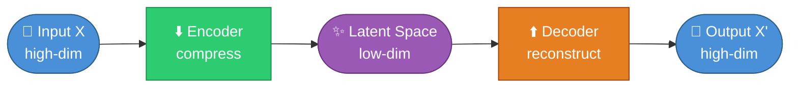
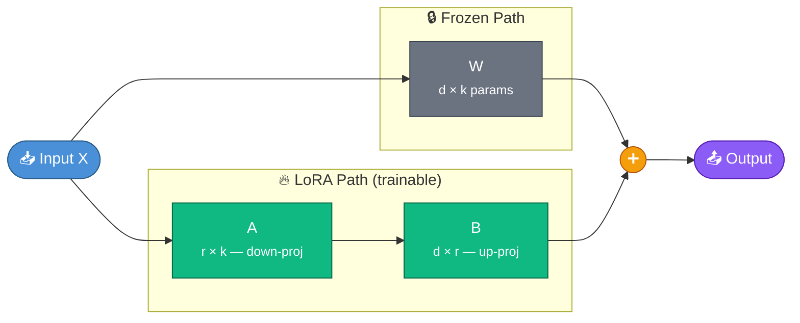
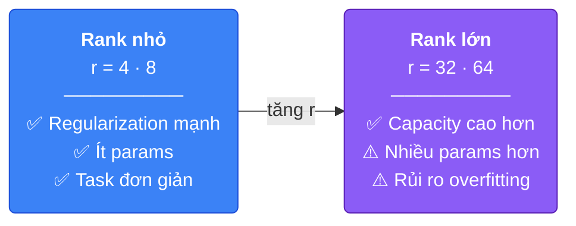
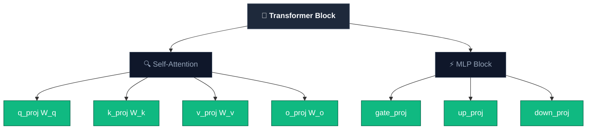
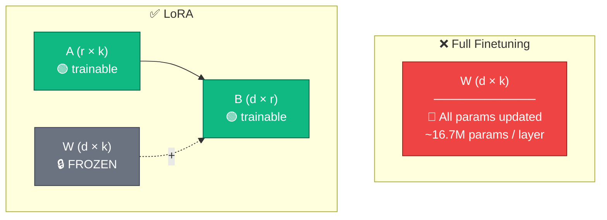

# Week 3 — LoRA: Low-Rank Adaptation từ Nguyên Lý Đầu Tiên

> Nguồn tham khảo chính: [Understanding LoRA from First Principles](https://theneuralmaze.substack.com/p/understanding-lora-from-first-principles) · [LoRA Paper (Hu et al., 2021)](https://arxiv.org/pdf/2106.09685)

---

## 1. Tại sao cần LoRA?

Trước khi hiểu LoRA là gì, cần hiểu vấn đề nó giải quyết: **full finetuning quá đắt**.

Khi finetune một LLM lớn (ví dụ 70B parameters), ta cần lưu trữ đồng thời:
- Gradients của toàn bộ weights
- Optimizer states (ví dụ Adam cần 2 moment vectors cho mỗi parameter)
- Bản thân các updated parameters

Với mô hình 70B, chỉ riêng optimizer states đã chiếm hàng trăm GB VRAM — vượt xa khả năng của hầu hết GPU thông thường.

Ngoài ra, full finetuning còn có nguy cơ **catastrophic forgetting**: khi train trên một domain hẹp (ví dụ medical coding), gradient có thể ghi đè lên kiến thức tổng quát mà mô hình đã học được trong pretraining.

```
Vấn đề của Full Finetuning:
┌─────────────────────────────────────────┐
│  Chi phí bộ nhớ = params + grads + opt  │
│  70B model ≈ 140GB (fp16) + ~560GB opt  │
│                                         │
│  Catastrophic forgetting khi domain hẹp │
└─────────────────────────────────────────┘
```

---

## 2. Intuition: Autoencoder và Không Gian Chiều Thấp

Để hiểu tại sao LoRA hoạt động, hãy nghĩ đến **autoencoder**.



Autoencoder chứng minh rằng: **dữ liệu chiều cao thường có thể được biểu diễn trong không gian chiều thấp hơn nhiều** mà không mất đi cấu trúc thiết yếu.

LoRA áp dụng cùng trực giác này, nhưng không phải cho dữ liệu — mà cho **weight updates**:

> Giả thuyết intrinsic rank: Sự thay đổi cần thiết trong weights khi finetune (`ΔW`) thực ra nằm trong một **subspace chiều thấp**, dù `W` ban đầu có chiều rất cao.

---

## 3. Toán học của LoRA

### Full Finetuning

Trong full finetuning, ta học một ma trận cập nhật `ΔW` dày đặc (dense):

```
W' = W + ΔW
```

Với `W ∈ ℝ^(d×k)`, `ΔW` cũng có kích thước `d×k` — cực kỳ tốn bộ nhớ.

### LoRA Factorization

LoRA thay thế `ΔW` bằng tích của hai ma trận nhỏ hơn:

```
ΔW = B · A

Trong đó:
  A ∈ ℝ^(r×k)   — ma trận "down-projection"
  B ∈ ℝ^(d×r)   — ma trận "up-projection"
  r << min(d, k) — rank (chiều của subspace)
```



Công thức đầy đủ với scaling:

```
W' = W + (α/r) · B · A
```

### Số lượng parameters so sánh

| Phương pháp | Trainable params (d=4096, k=4096) |
|---|---|
| Full finetuning | 4096 × 4096 = **16.7M** |
| LoRA r=8 | (4096×8) + (8×4096) = **65K** |
| LoRA r=16 | (4096×16) + (16×4096) = **131K** |
| LoRA r=64 | (4096×64) + (64×4096) = **524K** |

Với r=8, số params trainable giảm **~256 lần** so với full finetuning cho một layer.

---

## 4. Hai Quyết Định Kỹ Thuật Quan Trọng

### 4.1 Khởi tạo B = 0

Tại thời điểm bắt đầu training:

```
ΔW = B · A = 0 · A = 0
```

Điều này đảm bảo mô hình ban đầu hoạt động **y hệt base model** — không có perturbation đột ngột. Update tăng dần theo quá trình training.

### 4.2 Scaling factor α/r

```
W' = W + (α/r) · B · A
```

- `α` kiểm soát **độ mạnh** của update
- Chia cho `r` giúp **tách biệt** việc chọn rank khỏi việc chọn learning rate
- Khi thay đổi `r`, không cần retune learning rate từ đầu

---

## 5. Các Hyperparameter của LoRA

### 5.1 Rank `r` — quan trọng nhất



Thực tế: **r = 8 đến 32** hoạt động tốt cho hầu hết instruction-tuning tasks.

### 5.2 Alpha `α`

- Kiểm soát magnitude của update
- Rule of thumb phổ biến: `α = r` hoặc `α = 2r`
- Quá nhỏ → adapter không ảnh hưởng được mô hình
- Quá lớn → training không ổn định

### 5.3 Learning Rate

Dù chỉ train một phần nhỏ params, learning rate vẫn rất quan trọng:
- Quá cao → divergence hoặc noisy training
- Quá thấp → hội tụ chậm, adapter không học được

### 5.4 Target Modules

LoRA không áp dụng cho toàn bộ mô hình — ta chọn **các linear layer cụ thể** để inject adapter.



Targeting ít module hơn → tiết kiệm bộ nhớ nhưng có thể giảm performance. Targeting tất cả linear layers → kết quả gần với full finetuning nhất.

---

## 6. LoRA bên trong Transformer

Trong self-attention, mỗi token được chiếu vào 3 không gian:

```
Q = x · W_q        (token đang "tìm kiếm" gì?)
K = x · W_k        (token "chứa đựng" gì?)
V = x · W_v        (thông tin nào được truyền đi?)
Output = Attention(Q,K,V) · W_o
```

Khi áp dụng LoRA lên `W_q`:

```
Q = x · W_q  +  x · (α/r) · B_q · A_q
        ↑                    ↑
    frozen              trainable
```

Tương tự cho tất cả các projection matrix khác. W gốc không bao giờ bị thay đổi.

---

## 7. So sánh Full Finetuning vs LoRA



| Tiêu chí | Full Finetuning | LoRA |
|---|---|---|
| Trainable params | 100% | ~0.1–1% |
| VRAM cần thiết | Rất cao | Thấp hơn nhiều |
| Catastrophic forgetting | Rủi ro cao | Rủi ro thấp hơn |
| Tốc độ training | Chậm | Nhanh hơn |
| Merge vào base model | N/A | Có thể merge: `W' = W + BA` |
| Đổi task | Cần model mới | Chỉ cần đổi adapter |

---

## 8. Ưu điểm thực tế của LoRA

**Modularity**: Có thể train nhiều adapter cho nhiều task khác nhau, dùng chung một base model. Chỉ cần swap adapter khi đổi task.

```
Base Model (frozen)
    ├── adapter_medical.safetensors   (task: medical QA)
    ├── adapter_code.safetensors      (task: code generation)
    └── adapter_legal.safetensors     (task: legal analysis)
```

**Merge**: Sau khi train xong, có thể merge adapter vào base model để inference không có overhead:

```python
# Merge LoRA weights vào base model
model = model.merge_and_unload()
# Giờ W' = W + (α/r)·BA đã được tính sẵn
```

---

## 9. QLoRA — LoRA + Quantization

QLoRA kết hợp LoRA với **4-bit quantization** của base model, cho phép finetune các mô hình lớn trên GPU consumer-grade (ví dụ RTX 3090/4090).

```
QLoRA = 4-bit quantized base model (frozen)
      + LoRA adapters (fp16/bf16, trainable)
      + Double quantization (tiết kiệm thêm bộ nhớ)
      + Paged optimizers (xử lý memory spikes)
```

Với QLoRA, có thể finetune mô hình 65B trên một GPU 48GB — điều không thể với full finetuning.

---

## 10. Triển khai với Unsloth

```python
from unsloth import FastLanguageModel

model, tokenizer = FastLanguageModel.from_pretrained(
    model_name="unsloth/Qwen2.5-7B",
    max_seq_length=2048,
    load_in_4bit=True,  # QLoRA
)

model = FastLanguageModel.get_peft_model(
    model,
    r=16,                    # rank
    lora_alpha=16,           # alpha = r (stable default)
    target_modules=[
        "q_proj", "k_proj", "v_proj", "o_proj",
        "gate_proj", "up_proj", "down_proj",
    ],
    lora_dropout=0.0,
    bias="none",
)
```

---

## Tài liệu tham khảo

- [Hu et al. (2021) — LoRA: Low-Rank Adaptation of Large Language Models](https://arxiv.org/pdf/2106.09685)
- [The Neural Maze — Understanding LoRA from First Principles](https://theneuralmaze.substack.com/p/understanding-lora-from-first-principles)
- [Dettmers et al. (2023) — QLoRA: Efficient Finetuning of Quantized LLMs](https://arxiv.org/abs/2305.14314)
- [Hugging Face PEFT Library](https://github.com/huggingface/peft)
- [Unsloth — Fast LoRA Finetuning](https://unsloth.ai/)
- [MathWorks — What Is an Autoencoder?](https://www.mathworks.com/discovery/autoencoder.html)
