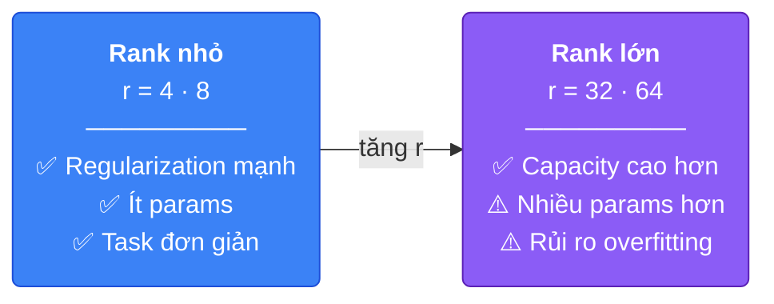
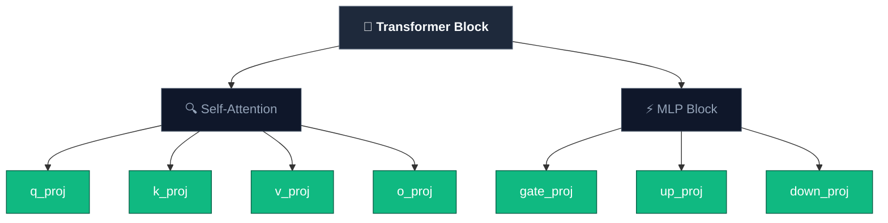
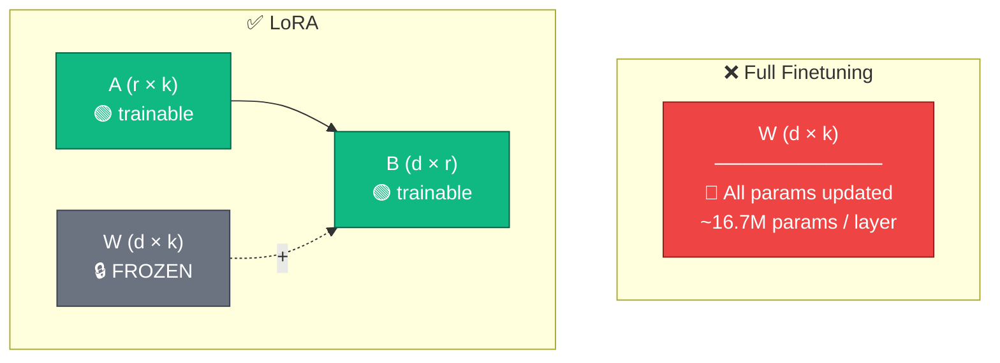

# Week 3 — LoRA: Low-Rank Adaptation

> Nguồn tham khảo chính: [Understanding LoRA from First Principles](https://theneuralmaze.substack.com/p/understanding-lora-from-first-principles) · [LoRA Paper (Hu et al., 2021)](https://arxiv.org/pdf/2106.09685)

---

## 1. Tại sao LoRA quan trọng?

**LoRA (Low-Rank Adaptation)** đã đi từ một research trick thành industry standard — là phương pháp mặc định cho efficient finetuning hiện nay. Hầu hết tutorials chỉ dạy gọi `get_peft_model(r=16)` mà không giải thích tại sao low-rank lại hoạt động.

Để thực sự hiểu LoRA, ta cần quay về nguyên lý đầu tiên: model chính là tập hợp các weight matrices — thay đổi weights tức là thay đổi behavior. Vậy câu hỏi đặt ra: **có cách nào thay đổi weights hiệu quả hơn full finetuning không?**

Câu trả lời: có — vì full finetuning vừa đắt, vừa không cần thiết phải update *toàn bộ* weights.

Khi finetune một LLM lớn (ví dụ 70B parameters), ta phải lưu đồng thời gradients, optimizer states (Adam cần 2 moment vectors cho mỗi parameter), và bản thân các updated parameters. Với model 70B, chỉ riêng optimizer states đã chiếm hàng trăm GB VRAM — vượt xa khả năng của hầu hết GPU.

Ngoài ra, full finetuning còn có nguy cơ **catastrophic forgetting**: gradient có thể ghi đè lên kiến thức tổng quát mà model đã học trong pretraining khi ta train trên một domain hẹp.

```
Vấn đề của Full Finetuning:
┌─────────────────────────────────────────┐
│  Chi phí bộ nhớ = params + grads + opt  │
│  70B model ≈ 140GB (fp16) + ~560GB opt  │
│                                         │
│  Catastrophic forgetting khi domain hẹp │
└─────────────────────────────────────────┘
```

---

## 2. PEFT — Nhóm phương pháp finetune hiệu quả

LoRA thuộc nhóm **PEFT (Parameter-Efficient Fine-Tuning)** — các phương pháp cho phép finetune LLM mà chỉ cần train một phần rất nhỏ parameters (thường <1%).

PEFT ra đời để giải quyết 3 vấn đề: VRAM quá lớn cho gradients + optimizer states, mỗi task cần lưu một bản copy đầy đủ model (tốn storage), và rủi ro catastrophic forgetting khi update toàn bộ weights.

### Các phương pháp PEFT phổ biến

| Phương pháp | Ý tưởng | Trainable params |
|---|---|---|
| **LoRA** | Inject low-rank matrices A, B song song với W gốc | ~0.1–1% |
| **QLoRA** | LoRA + 4-bit quantization base model | ~0.1–1% (VRAM thấp hơn) |
| **Prefix Tuning** | Thêm learnable prefix tokens vào input | Rất ít |
| **Prompt Tuning** | Thêm soft prompt embeddings | Rất ít |
| **Adapters** | Thêm small bottleneck layers giữa các Transformer layers | ~2–4% |

Trong số này, **LoRA là phổ biến nhất** nhờ cân bằng tốt giữa hiệu quả, performance, và dễ sử dụng.

### `get_peft_model` — biến base model thành PEFT model

Hàm `get_peft_model` (từ HF PEFT library hoặc Unsloth wrapper) thực hiện 3 việc:

1. **Freeze toàn bộ weights gốc W** — W không còn nhận gradient
2. **Tạo ma trận A và B** (LoRA adapters) cho mỗi target module được chỉ định
3. **Gắn A, B song song với W** — output trở thành `W·x + (α/r)·B·A·x`

```
Trước get_peft_model:   x → W·x                    (toàn bộ W trainable)
Sau get_peft_model:     x → W·x + (α/r)·B·A·x     (W frozen, chỉ A và B trainable)
```

Từ đây, khi gọi `trainer.train()`, chỉ A và B được update — W gốc không bị đụng tới.

### Lợi ích thực tế

- **Modularity**: train nhiều adapter cho nhiều task, dùng chung 1 base model
- **Storage**: mỗi adapter chỉ ~50-100MB thay vì hàng GB
- **Merge**: sau training có thể merge adapter vào base model (`W' = W + (α/r)·B·A`) → inference không thêm overhead
- **Swap**: đổi task chỉ cần đổi adapter file, không cần load lại model

---

## 3. Bối cảnh kiến trúc Transformer

LoRA được áp dụng lên Transformer — kiến trúc nền tảng của hầu hết LLM hiện đại. Có 3 biến thể chính:

| Kiến trúc | Chức năng | Ví dụ |
|---|---|---|
| **Encoder-only** | Understanding & representation | BERT, RoBERTa |
| **Decoder-only** | Autoregressive generation | GPT, LLaMA, Qwen |
| **Encoder-Decoder** | Structured transformation (dịch thuật...) | T5, BART |

Hầu hết LLM hiện tại (GPT-4, LLaMA, Qwen, Mistral...) đều dùng kiến trúc **Decoder-only**. LoRA hoạt động bằng cách inject adapter vào các linear projection layers bên trong các Transformer block.

---

## 4. Trực giác từ Autoencoder — tại sao LoRA hoạt động?

Để hiểu tại sao LoRA hoạt động, hãy đổi góc nhìn sang **autoencoder**:

- **Encoder** nén dữ liệu chiều cao vào một **latent space chiều thấp**
- **Decoder** reconstruct lại input gốc từ latent space đó


Insight cốt lõi: **thông tin chiều cao thường có thể sống trong không gian chiều thấp hơn nhiều.** Ví dụ, ảnh 784 pixels có thể nén vào 32 dimensions mà decoder vẫn reconstruct gần nguyên vẹn. Thông tin hữu ích tập trung trong một subspace nhỏ.

LoRA áp dụng đúng ý tưởng này — nhưng cho **weight updates** thay vì dữ liệu. Thay vì học `ΔW` dày đặc trong toàn bộ không gian `d × k`, LoRA giả định rằng sự thay đổi cần thiết cũng nằm trong một subspace chiều thấp.

Đây chính là **Intrinsic Rank Hypothesis**: `ΔW` có rank thấp, dù `W` ban đầu có chiều rất cao.

---

## 5. Trực giác từ Recommender Systems — SVD

Một góc nhìn bổ sung đến từ **matrix factorization** trong recommender systems.

**SVD (Singular Value Decomposition)** phân rã ma trận thành 3 thành phần: `X = U · Σ · Vᵀ`. Trong thực tế, ta thường đơn giản hóa thành `R ≈ U × V` (hấp thụ Σ vào U hoặc V).

Ví dụ: một ma trận rating phim (users × movies) rất lớn và sparse, nhưng có thể phân rã thành hai ma trận nhỏ:

```
R (n × m)  ≈  U (n × k)  ×  V (k × m)       với k << min(n, m)
```

- **U** (n × k): mỗi user biểu diễn bởi k latent factors (thích action? romance?)
- **V** (k × m): mỗi movie biểu diễn bởi k latent factors
- **k** rất nhỏ (10-50) so với hàng triệu users/movies

Hai ma trận nhỏ capture được **latent preferences** — dù ma trận gốc có hàng triệu entries.

### Kết nối sang LoRA

| RecSys (SVD) | LoRA |
|---|---|
| Ma trận lớn R (n × m) | Ma trận update ΔW (d × k) |
| Phân rã thành U × V | Phân rã thành B × A |
| k latent factors << n, m | rank r << d, k |
| Capture latent preferences | Capture adaptation signal |

Nguyên lý chung: **ma trận lớn ≈ tích của các ma trận nhỏ hơn**, và cấu trúc low-rank capture được signal chính, bỏ qua noise. LoRA áp dụng đúng nguyên lý này cho weight updates.

---

## 6. Full Finetuning thực sự làm gì?

Kiến thức của model nằm trong các weight matrices W. Finetuning học một modification `ΔW`, rồi cập nhật: `W' = W + ΔW`.

Trong full finetuning, `ΔW` là một ma trận dense cùng kích thước với W — tức `d × k` parameters. Toàn bộ W đều được update, tạo ra dense correction trên toàn bộ ma trận.

Đơn giản. Hiệu quả. Nhưng cực kỳ đắt.

---

## 7. Ý tưởng cốt lõi của LoRA

Thay vì học `ΔW` dense, LoRA factorize nó thành tích của hai ma trận nhỏ:

**ΔW = B · A**

```
A ∈ ℝ^(r×k)   — down-projection (từ k chiều xuống r chiều)
B ∈ ℝ^(d×r)   — up-projection (từ r chiều lên d chiều)
r << min(d, k) — rank, chiều của subspace
```

W gốc bị **freeze**, chỉ A và B là **trainable**.


Công thức đầy đủ với scaling: `W' = W + (α/r) · B · A`

### So sánh số lượng parameters

| Phương pháp | Trainable params (d=4096, k=4096) |
|---|---|
| Full finetuning | 4096 × 4096 = **16.7M** |
| LoRA r=8 | (4096×8) + (8×4096) = **65K** |
| LoRA r=16 | (4096×16) + (16×4096) = **131K** |
| LoRA r=64 | (4096×64) + (64×4096) = **524K** |

Với r=8, số params trainable giảm **~256 lần** so với full finetuning — cho một layer duy nhất.

---

## 8. Tại sao LoRA training ổn định?

Hai design decisions giúp LoRA không phá vỡ model khi bắt đầu train:

### 8.1 Khởi tạo B = 0

Theo paper gốc, **A** được khởi tạo bằng random Gaussian, còn **B** được khởi tạo bằng zero. Kết quả: `ΔW = B · A = 0` tại thời điểm bắt đầu — model hoạt động y hệt base model, không có perturbation đột ngột. Update tăng dần khi B bắt đầu được cập nhật.

### 8.2 Scaling factor α/r

```
W → W + (α/r) · B · A
```

`α` kiểm soát độ mạnh của update. Chia cho `r` giúp **tách biệt rank khỏi magnitude** — khi thay đổi `r`, không cần retune learning rate từ đầu. Đây là lý do ta có thể thử nghiệm nhiều giá trị `r` mà training vẫn ổn định.

---

## 9. Hyperparameters của LoRA

Dù LoRA train ít parameters hơn, việc chọn hyperparameters vẫn rất quan trọng — thậm chí **nhạy hơn** full finetuning, vì subspace nhỏ hơn đồng nghĩa mỗi thay đổi có ảnh hưởng lớn hơn.

Ba hyperparameters chính kiểm soát behavior của LoRA:
- **Capacity** → Rank (r)
- **Magnitude** → Alpha (α)
- **Optimization dynamics** → Learning rate

### 9.1 Rank `r` — quan trọng nhất



Trong thực tế, **r = 8 đến 32** hoạt động tốt cho hầu hết instruction-tuning tasks.

### 9.2 Alpha `α`

Kiểm soát magnitude của update. Rule of thumb phổ biến: `α = r` hoặc `α = 2r`. Quá nhỏ thì adapter không ảnh hưởng được model, quá lớn thì training không ổn định.

### 9.3 Learning Rate

Quá cao dẫn đến divergence, quá thấp thì adapter không học được. Dù chỉ train <1% params, learning rate vẫn cần tune cẩn thận.

---

## 10. Target Modules — LoRA inject vào đâu?

Trong Transformer, không chỉ có một ma trận W — mỗi layer chứa nhiều projection matrices. LoRA cho phép chọn inject adapter vào **những layer cụ thể nào**.

### Attention Modules

Mỗi layer có một Multi-Head Attention block với 4 projection matrices:

| Module | Vai trò |
|---|---|
| **q_proj** (W_q) | Tạo Query — token đang "tìm kiếm" thông tin gì? |
| **k_proj** (W_k) | Tạo Key — token "chứa đựng" thông tin gì? |
| **v_proj** (W_v) | Tạo Value — thông tin nào được truyền đi khi attend? |
| **o_proj** (W_o) | Output projection — kết hợp kết quả từ tất cả heads |

### MLP Modules

Trong các model hiện đại dùng **SwiGLU** (LLaMA, Qwen, Mistral...), MLP block có 3 projection matrices:

| Module | Vai trò |
|---|---|
| **gate_proj** | Gating — quyết định thông tin nào được "mở cổng" |
| **up_proj** | Expand — project lên chiều cao hơn |
| **down_proj** | Compress — project xuống chiều ban đầu |

```
MLP(x) = down_proj( SiLU(gate_proj(x)) × up_proj(x) )
```

> Lưu ý: paper LoRA gốc (2021) chỉ thí nghiệm trên attention weights và freeze MLP. Việc apply LoRA lên cả MLP là practice phổ biến hiện nay (Unsloth, QLoRA...) nhưng không nằm trong paper gốc.

### Trade-off khi chọn target modules

| Strategy | Modules | Expressiveness |
|---|---|---|
| Minimal | q_proj, v_proj | Thấp — chỉ thay đổi cách attend |
| Attention only | q, k, v, o_proj | Trung bình |
| All linear (recommended) | q, k, v, o + gate, up, down | Cao — gần full finetuning |

Ít module hơn → tiết kiệm bộ nhớ nhưng kém expressive. Nhiều module hơn → kết quả tốt hơn nhưng tốn resource hơn.



---

## 11. LoRA bên trong Transformer

Cụ thể hơn, khi áp dụng LoRA lên self-attention, mỗi token được chiếu qua các projection:

```
Q = x · W_q        (token đang "tìm kiếm" gì?)
K = x · W_k        (token "chứa đựng" gì?)
V = x · W_v        (thông tin nào được truyền đi?)
Output = Attention(Q,K,V) · W_o
```

Với LoRA trên `W_q`, forward pass trở thành:

```
Q = x · W_q  +  x · (α/r) · B_q · A_q
        ↑                    ↑
    frozen              trainable
```

Tương tự cho các projection khác. W gốc không bao giờ bị thay đổi.

---

## 12. So sánh Full Finetuning vs LoRA



| Tiêu chí | Full Finetuning | LoRA |
|---|---|---|
| Trainable params | 100% | ~0.1–1% |
| VRAM cần thiết | Rất cao | Thấp hơn nhiều |
| Catastrophic forgetting | Rủi ro cao | Rủi ro thấp hơn |
| Tốc độ training | Chậm | Nhanh hơn |
| Merge vào base model | N/A | `W' = W + BA` |
| Đổi task | Cần model mới | Chỉ cần đổi adapter |

---

## 13. Ưu điểm thực tế

**Modularity** — train nhiều adapter cho nhiều task, dùng chung một base model:

```
Base Model (frozen)
    ├── adapter_medical.safetensors   (medical QA)
    ├── adapter_code.safetensors      (code generation)
    └── adapter_legal.safetensors     (legal analysis)
```

**Merge** — sau training, merge adapter vào base model để inference không có overhead:

```python
model = model.merge_and_unload()
# W' = W + (α/r)·BA đã được tính sẵn, không cần adapter riêng nữa
```

---

## 14. Hạn chế của LoRA

LoRA không phải silver bullet — có những trade-off cần hiểu rõ.

### 14.1 Capacity bị giới hạn bởi rank

LoRA giả định `ΔW` là low-rank. Với task đơn giản (instruction following, style transfer), giả định này đúng. Nhưng với domain shift lớn (ví dụ English chat → code generation chuyên sâu), low-rank update có thể không đủ expressive. Tăng `r` để bù thì mất dần lợi thế efficiency.

### 14.2 Không bằng full finetuning trên mọi task

Paper gốc cho thấy LoRA đạt on-par hoặc tốt hơn full finetuning trên nhiều benchmark (RoBERTa, DeBERTa, GPT-2, GPT-3). Tuy nhiên, với task cần thay đổi sâu kiến thức hoặc học lượng lớn thông tin mới, full finetuning vẫn có thể tốt hơn.

### 14.3 Hyperparameter sensitivity

Vì train trong subspace nhỏ, mỗi hyperparameter có ảnh hưởng lớn hơn: `r` quá nhỏ → underfitting, quá lớn → overfitting. `α` và learning rate cần tune cẩn thận — sai có thể dẫn đến training không ổn định.

### 14.4 Không batch được nhiều task cùng lúc

Paper gốc đề cập trực tiếp: nếu merge adapter vào W để loại bỏ inference latency, thì không thể xử lý đồng thời các input thuộc task khác nhau trong cùng 1 batch (vì mỗi task có adapter riêng). Giải pháp: giữ adapter riêng và chọn dynamically — nhưng sẽ thêm latency.

### 14.5 Trade-off giữa latency và flexibility

| Strategy | Latency | Flexibility |
|---|---|---|
| **Merge** adapter vào W | Không thêm latency | Phải tính lại khi đổi task |
| **Giữ riêng** adapter | Thêm latency mỗi forward pass | Swap adapter dễ dàng |

---

## 15. QLoRA — LoRA + Quantization

QLoRA kết hợp LoRA với **4-bit quantization** của base model, cho phép finetune model lớn trên GPU consumer-grade (RTX 3090/4090).

```
QLoRA = 4-bit quantized base model (frozen)
      + LoRA adapters (fp16/bf16, trainable)
      + Double quantization (tiết kiệm thêm bộ nhớ)
      + Paged optimizers (xử lý memory spikes)
```

Theo paper QLoRA (Dettmers et al., 2023), có thể finetune model 65B trên một GPU 48GB — điều không thể với full finetuning.

---

## 16. Triển khai với Unsloth

```python
from unsloth import FastLanguageModel

model, tokenizer = FastLanguageModel.from_pretrained(
    model_name="unsloth/Qwen2.5-7B",
    max_seq_length=2048,
    load_in_4bit=True,  # QLoRA
)

model = FastLanguageModel.get_peft_model(
    model,
    r=16,                    # rank
    lora_alpha=16,           # alpha = r (stable default)
    target_modules=[
        "q_proj", "k_proj", "v_proj", "o_proj",
        "gate_proj", "up_proj", "down_proj",
    ],
    lora_dropout=0.0,
    bias="none",
)
```

---

## Tài liệu tham khảo

- [Hu et al. (2021) — LoRA: Low-Rank Adaptation of Large Language Models](https://arxiv.org/pdf/2106.09685)
- [The Neural Maze — Understanding LoRA from First Principles](https://theneuralmaze.substack.com/p/understanding-lora-from-first-principles)
- [Dettmers et al. (2023) — QLoRA: Efficient Finetuning of Quantized LLMs](https://arxiv.org/abs/2305.14314)
- [Hugging Face PEFT Library](https://github.com/huggingface/peft)
- [Unsloth — Fast LoRA Finetuning](https://unsloth.ai/)
