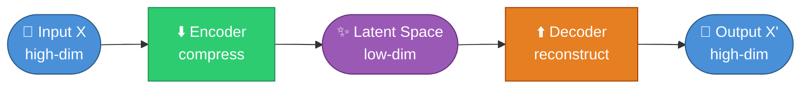
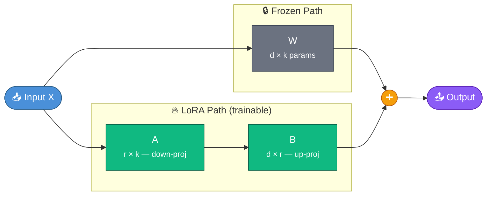
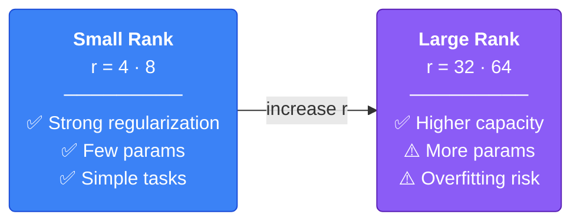
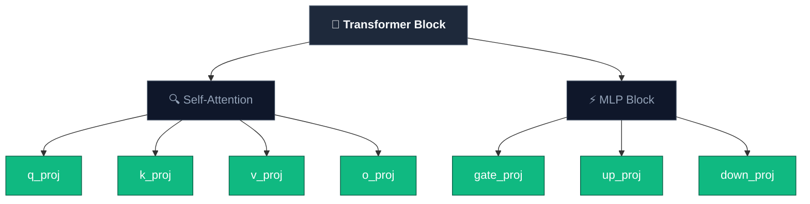
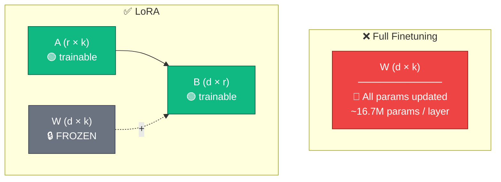

# Week 3 — LoRA: Low-Rank Adaptation

> Main references: [Understanding LoRA from First Principles](https://theneuralmaze.substack.com/p/understanding-lora-from-first-principles) · [LoRA Paper (Hu et al., 2021)](https://arxiv.org/pdf/2106.09685)

---

## 1. Why LoRA Matters

**LoRA (Low-Rank Adaptation)** has evolved from a research novelty into an industry standard — the default method for efficient finetuning. Most tutorials teach calling `get_peft_model(r=16)` without explaining *why* low-rank approximation works in the first place.

To truly understand LoRA, we must return to first principles: a model is fundamentally a collection of weight matrices — changing weights means changing behavior. The question then becomes: **is there a more efficient way to modify weights than full finetuning?**

The answer is yes — because full finetuning is both prohibitively expensive and unnecessarily thorough in its updates.

When finetuning a large LLM (e.g., 70B parameters), one must simultaneously store gradients, optimizer states (Adam requires 2 moment vectors per parameter), and the updated parameters themselves. For a 70B model, the optimizer states alone consume hundreds of GB of VRAM — far exceeding the capacity of most GPUs.

Moreover, full finetuning carries the risk of **catastrophic forgetting**: gradients may overwrite the general knowledge the model acquired during pretraining when training on a narrow domain.

```
The Problem with Full Finetuning:
┌─────────────────────────────────────────┐
│  Memory cost = params + grads + opt     │
│  70B model ≈ 140GB (fp16) + ~560GB opt │
│                                         │
│  Catastrophic forgetting on narrow data │
└─────────────────────────────────────────┘
```

---

## 2. PEFT — Parameter-Efficient Fine-Tuning Methods

LoRA belongs to the family of **PEFT (Parameter-Efficient Fine-Tuning)** methods — techniques that enable finetuning LLMs while training only a very small fraction of parameters (typically <1%).

PEFT was developed to address three fundamental challenges: the prohibitive VRAM requirements for storing gradients and optimizer states, the storage cost of maintaining a full model copy per task, and the risk of catastrophic forgetting when updating all weights.

### Common PEFT Methods

| Method | Core Idea | Trainable params |
|---|---|---|
| **LoRA** | Inject low-rank matrices A, B in parallel with original W | ~0.1–1% |
| **QLoRA** | LoRA + 4-bit quantization of base model | ~0.1–1% (lower VRAM) |
| **Prefix Tuning** | Add learnable prefix tokens to input | Very few |
| **Prompt Tuning** | Add soft prompt embeddings | Very few |
| **Adapters** | Insert small bottleneck layers between Transformer layers | ~2–4% |

Among these, **LoRA is the most widely adopted**, offering the best balance between effectiveness, performance, and ease of use.

### `get_peft_model` — Converting a Base Model to a PEFT Model

The `get_peft_model` function (from the HF PEFT library or Unsloth wrapper) performs three operations:

1. **Freeze all original weights W** — W no longer receives gradients
2. **Create matrices A and B** (LoRA adapters) for each specified target module
3. **Attach A, B in parallel with W** — the output becomes `W·x + (α/r)·B·A·x`

```
Before get_peft_model:   x → W·x                    (all of W trainable)
After get_peft_model:    x → W·x + (α/r)·B·A·x     (W frozen, only A and B trainable)
```

From this point onward, when calling `trainer.train()`, only A and B are updated — the original W remains untouched.

### Practical Benefits

- **Modularity**: train multiple adapters for multiple tasks, sharing a single base model
- **Storage**: each adapter is only ~50–100MB rather than multiple GB
- **Merge**: after training, the adapter can be merged into the base model (`W' = W + (α/r)·B·A`) with zero inference overhead
- **Swap**: switch tasks by simply swapping adapter files, no need to reload the model

---

## 3. Transformer Architecture Context

LoRA is applied on top of the Transformer — the foundational architecture behind most modern LLMs. There are three principal variants:

| Architecture | Function | Examples |
|---|---|---|
| **Encoder-only** | Understanding & representation | BERT, RoBERTa |
| **Decoder-only** | Autoregressive generation | GPT, LLaMA, Qwen |
| **Encoder-Decoder** | Structured transformation (translation, etc.) | T5, BART |

Most current LLMs (GPT-4, LLaMA, Qwen, Mistral, etc.) employ the **Decoder-only** architecture. LoRA operates by injecting adapters into the linear projection layers within Transformer blocks.

---

## 4. Intuition from Autoencoders — Why LoRA Works

To understand why LoRA works, consider the **autoencoder** paradigm:

- The **Encoder** compresses high-dimensional data into a **low-dimensional latent space**
- The **Decoder** reconstructs the original input from that latent space



The core insight: **high-dimensional information can often reside in a much lower-dimensional space.** For instance, a 784-pixel image can be compressed into 32 dimensions, and the decoder still reconstructs it nearly intact. Useful information concentrates within a small subspace.

LoRA applies precisely this principle — but to **weight updates** rather than data. Instead of learning a dense `ΔW` across the entire `d × k` space, LoRA posits that the necessary changes also lie within a low-dimensional subspace.

This is the **Intrinsic Rank Hypothesis**: `ΔW` has low rank, even though `W` is very high-dimensional to begin with.

---

## 5. Intuition from Recommender Systems — SVD

A complementary perspective comes from **matrix factorization** in recommender systems.

**SVD (Singular Value Decomposition)** factorizes a matrix into three components: `X = U · Σ · Vᵀ`. In practice, this is often simplified to `R ≈ U × V` (absorbing Σ into U or V).

For example, a movie rating matrix (users × movies) is enormous and sparse, yet can be factorized into two small matrices:

```
R (n × m)  ≈  U (n × k)  ×  V (k × m)       where k << min(n, m)
```

- **U** (n × k): each user is represented by k latent factors (preference for action? romance?)
- **V** (k × m): each movie is represented by k latent factors
- **k** is very small (10–50) compared to millions of users and movies

Two compact matrices capture **latent preferences** — even when the original matrix has millions of entries.

### Connecting to LoRA

| RecSys (SVD) | LoRA |
|---|---|
| Large matrix R (n × m) | Update matrix ΔW (d × k) |
| Factorized into U × V | Factorized into B × A |
| k latent factors << n, m | rank r << d, k |
| Captures latent preferences | Captures adaptation signal |

The general principle: **a large matrix can be approximated by the product of smaller matrices**, and the low-rank structure captures the primary signal while discarding noise. LoRA applies this exact principle to weight updates.

---

## 6. What Does Full Finetuning Actually Do?

A model's knowledge resides in its weight matrices W. Finetuning learns a modification `ΔW`, then updates: `W' = W + ΔW`.

In full finetuning, `ΔW` is a dense matrix of the same dimensions as W — that is, `d × k` parameters. Every element of W is updated, producing a dense correction across the entire matrix.

Simple. Effective. But prohibitively expensive.

---

## 7. LoRA's Core Idea

Rather than learning a dense `ΔW`, LoRA factorizes it into the product of two small matrices:

**ΔW = B · A**

```
A ∈ ℝ^(r×k)   — down-projection (from k dimensions down to r)
B ∈ ℝ^(d×r)   — up-projection (from r dimensions up to d)
r << min(d, k) — rank, the dimension of the subspace
```

The original W is **frozen**; only A and B are **trainable**.



The complete formula with scaling: `W' = W + (α/r) · B · A`

### Parameter Count Comparison

| Method | Trainable params (d=4096, k=4096) |
|---|---|
| Full finetuning | 4096 × 4096 = **16.7M** |
| LoRA r=8 | (4096×8) + (8×4096) = **65K** |
| LoRA r=16 | (4096×16) + (16×4096) = **131K** |
| LoRA r=64 | (4096×64) + (64×4096) = **524K** |

With r=8, the number of trainable parameters drops by a factor of **~256x** compared to full finetuning — for a single layer.

---

## 8. Why LoRA Training Remains Stable

Two key design decisions prevent LoRA from disrupting the model at the start of training:

### 8.1 Initializing B = 0

Per the original paper, **A** is initialized with random Gaussian values, while **B** is initialized to zero. The result: `ΔW = B · A = 0` at the outset — the model behaves identically to the base model, with no sudden perturbation. Updates accumulate gradually as B begins to receive gradients.

### 8.2 Scaling Factor α/r

```
W → W + (α/r) · B · A
```

`α` controls the magnitude of the update. Dividing by `r` **decouples rank from magnitude** — when changing `r`, there is no need to retune the learning rate from scratch. This is why one can experiment with different values of `r` while maintaining training stability.

---

## 9. LoRA Hyperparameters

Although LoRA trains fewer parameters, hyperparameter selection remains critically important — and is arguably **more sensitive** than in full finetuning, since a smaller subspace means each change carries greater influence.

Three primary hyperparameters govern LoRA's behavior:
- **Capacity** → Rank (r)
- **Magnitude** → Alpha (α)
- **Optimization dynamics** → Learning rate

### 9.1 Rank `r` — The Most Critical Hyperparameter



In practice, **r = 8 to 32** performs well for most instruction-tuning tasks.

### 9.2 Alpha `α`

Controls the magnitude of the update. Common rules of thumb: `α = r` or `α = 2r`. Too small, and the adapter cannot meaningfully influence the model; too large, and training becomes unstable.

### 9.3 Learning Rate

Too high leads to divergence; too low, and the adapter fails to learn. Despite training fewer than 1% of parameters, the learning rate still requires careful tuning.

---

## 10. Target Modules — Where Does LoRA Inject?

Within a Transformer, there is not just one matrix W — each layer contains multiple projection matrices. LoRA allows selective injection of adapters into **specific layers**.

### Attention Modules

Each layer has a Multi-Head Attention block with 4 projection matrices:

| Module | Role |
|---|---|
| **q_proj** (W_q) | Produces Query — what information is the token "looking for"? |
| **k_proj** (W_k) | Produces Key — what information does the token "contain"? |
| **v_proj** (W_v) | Produces Value — what information is transmitted when attended to? |
| **o_proj** (W_o) | Output projection — combines results from all attention heads |

### MLP Modules

In modern models employing **SwiGLU** (LLaMA, Qwen, Mistral, etc.), the MLP block has 3 projection matrices:

| Module | Role |
|---|---|
| **gate_proj** | Gating — determines which information is allowed to pass through |
| **up_proj** | Expands — projects to a higher dimension |
| **down_proj** | Compresses — projects back to the original dimension |

```
MLP(x) = down_proj( SiLU(gate_proj(x)) × up_proj(x) )
```

> Note: the original LoRA paper (2021) experimented only on attention weights and kept MLP frozen. Applying LoRA to MLP layers as well is now common practice (Unsloth, QLoRA, etc.) but was not part of the original paper.

### Trade-off When Choosing Target Modules

| Strategy | Modules | Expressiveness |
|---|---|---|
| Minimal | q_proj, v_proj | Low — only modifies attention patterns |
| Attention only | q, k, v, o_proj | Moderate |
| All linear (recommended) | q, k, v, o + gate, up, down | High — approaches full finetuning |

Fewer modules → lower memory consumption but reduced expressiveness. More modules → better results but greater resource requirements.



---

## 11. LoRA Inside the Transformer

More concretely, when applying LoRA to self-attention, each token is projected through the following transformations:

```
Q = x · W_q        (what is the token "searching" for?)
K = x · W_k        (what does the token "contain"?)
V = x · W_v        (what information gets transmitted?)
Output = Attention(Q,K,V) · W_o
```

With LoRA applied to `W_q`, the forward pass becomes:

```
Q = x · W_q  +  x · (α/r) · B_q · A_q
        ↑                    ↑
    frozen              trainable
```

The same applies to the other projections. The original W is never modified.

---

## 12. Full Finetuning vs. LoRA — A Comparison



| Criterion | Full Finetuning | LoRA |
|---|---|---|
| Trainable params | 100% | ~0.1–1% |
| VRAM required | Very high | Significantly lower |
| Catastrophic forgetting | High risk | Lower risk |
| Training speed | Slower | Faster |
| Merge into base model | N/A | `W' = W + BA` |
| Switch tasks | Requires a new model | Simply swap adapters |

---

## 13. Practical Advantages

**Modularity** — train multiple adapters for multiple tasks, all sharing one base model:

```
Base Model (frozen)
    ├── adapter_medical.safetensors   (medical QA)
    ├── adapter_code.safetensors      (code generation)
    └── adapter_legal.safetensors     (legal analysis)
```

**Merge** — after training, merge the adapter into the base model for zero-overhead inference:

```python
model = model.merge_and_unload()
# W' = W + (α/r)·BA is pre-computed; no separate adapter is needed
```

---

## 14. Limitations of LoRA

LoRA is not a silver bullet — there are important trade-offs to understand.

### 14.1 Capacity Constrained by Rank

LoRA assumes `ΔW` is low-rank. For straightforward tasks (instruction following, style transfer), this assumption holds. However, for large domain shifts (e.g., English chat → specialized code generation), low-rank updates may lack sufficient expressiveness. Increasing `r` to compensate gradually erodes the efficiency advantage.

### 14.2 Not Superior to Full Finetuning on Every Task

The original paper demonstrates that LoRA achieves on-par or better results than full finetuning on many benchmarks (RoBERTa, DeBERTa, GPT-2, GPT-3). Nevertheless, for tasks requiring deep knowledge restructuring or learning substantial amounts of new information, full finetuning may still be the stronger approach.

### 14.3 Hyperparameter Sensitivity

Since training occurs within a small subspace, each hyperparameter has amplified impact: `r` too small → underfitting, too large → overfitting. `α` and learning rate require careful tuning — poor choices can lead to training instability.

### 14.4 Cannot Batch Multiple Tasks Simultaneously

The original paper explicitly notes: if adapters are merged into W to eliminate inference latency, it becomes impossible to simultaneously process inputs from different tasks within the same batch (since each task has its own adapter). The alternative is to keep adapters separate and select dynamically — but this introduces additional latency.

### 14.5 Trade-off Between Latency and Flexibility

| Strategy | Latency | Flexibility |
|---|---|---|
| **Merge** adapter into W | No additional latency | Must recompute when switching tasks |
| **Keep** adapter separate | Added latency per forward pass | Easy adapter swapping |

---

## 15. QLoRA — LoRA with Quantization

QLoRA combines LoRA with **4-bit quantization** of the base model, enabling finetuning of large models on consumer-grade GPUs (RTX 3090/4090).

```
QLoRA = 4-bit quantized base model (frozen)
      + LoRA adapters (fp16/bf16, trainable)
      + Double quantization (additional memory savings)
      + Paged optimizers (handles memory spikes)
```

According to the QLoRA paper (Dettmers et al., 2023), it is possible to finetune a 65B model on a single 48GB GPU — something entirely infeasible with full finetuning.

---

## 16. Implementation with Unsloth

```python
from unsloth import FastLanguageModel

model, tokenizer = FastLanguageModel.from_pretrained(
    model_name="unsloth/Qwen2.5-7B",
    max_seq_length=2048,
    load_in_4bit=True,  # QLoRA
)

model = FastLanguageModel.get_peft_model(
    model,
    r=16,                    # rank
    lora_alpha=16,           # alpha = r (stable default)
    target_modules=[
        "q_proj", "k_proj", "v_proj", "o_proj",
        "gate_proj", "up_proj", "down_proj",
    ],
    lora_dropout=0.0,
    bias="none",
)
```

---

## References

- [Hu et al. (2021) — LoRA: Low-Rank Adaptation of Large Language Models](https://arxiv.org/pdf/2106.09685)
- [The Neural Maze — Understanding LoRA from First Principles](https://theneuralmaze.substack.com/p/understanding-lora-from-first-principles)
- [Dettmers et al. (2023) — QLoRA: Efficient Finetuning of Quantized LLMs](https://arxiv.org/abs/2305.14314)
- [Hugging Face PEFT Library](https://github.com/huggingface/peft)
- [Unsloth — Fast LoRA Finetuning](https://unsloth.ai/)
